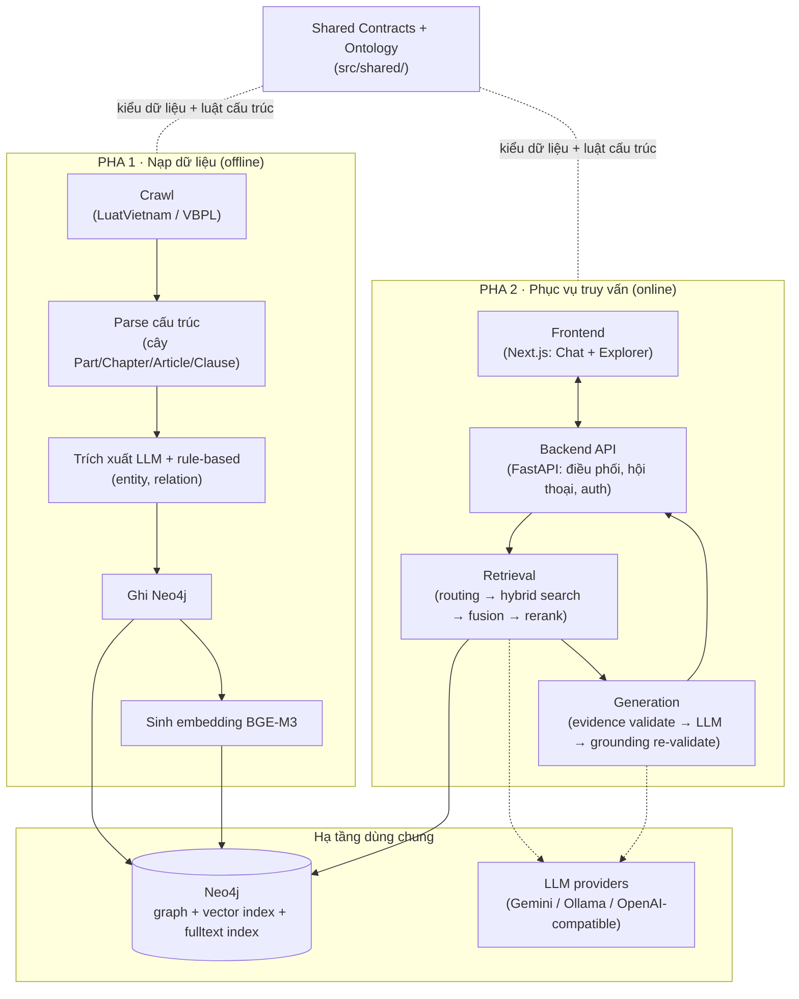

# Legal GraphRAG VN

**Thực hiện bởi sinh viên Học viện Công nghệ Bưu chính Viễn thông Cơ sở Hồ Chí Minh (PTIT HCM):**
- [Đặng Xuân Lâm - N22DCCN047](https://github.com/lamdx4)
- [Nguyễn Anh Kha - N22DCCN038](https://github.com/anhkha30804)
- [Phan Nhật Minh - N22DCC054](https://github.com/nhatminh16704)

**Giáo viên hướng dẫn:** Nguyễn Thị Bích Nguyên

Hệ thống trả lời câu hỏi pháp luật Việt Nam có **trích dẫn kiểm chứng được** (grounded citation), dựng trên một đồ thị tri thức pháp lý (Neo4j) được nạp bằng trích xuất tự động (LLM) từ văn bản luật thô. Khác với RAG thông thường ở 2 điểm: phải xử lý đúng **hiệu lực theo thời gian** của quy phạm pháp luật (một điều luật có thể đã bị sửa đổi/bãi bỏ/thay thế tại thời điểm hỏi), và phải **từ chối trả lời** thay vì suy diễn khi không đủ căn cứ hoặc không xác định được mốc thời gian áp dụng.

Tài liệu này trình bày kiến trúc theo hướng từ tổng quan xuống chi tiết: bức tranh toàn hệ thống trước, sau đó đi sâu vào từng lớp/component.

---

## 1. Bức tranh tổng thể

Hệ thống chia làm 2 pha vận hành độc lập, nối với nhau qua Neo4j:

- **Pha nạp dữ liệu (offline)** — biến văn bản luật thô thành đồ thị tri thức: `Pipeline` crawl/parse/trích xuất, `Infrastructure` ghi kết quả vào Neo4j và sinh embedding.
- **Pha phục vụ truy vấn (online)** — trả lời câu hỏi người dùng dựa trên đồ thị đó: `Frontend` nhận câu hỏi → `Backend API` điều phối → `Retrieval` tìm bằng chứng → `Generation` sinh câu trả lời có kiểm chứng → trả ngược lên `Frontend`.

**Nguyên tắc kiến trúc**: ports-and-adapters (hexagonal). `Retrieval` và `Generation` chỉ phụ thuộc interface của chính mình (`ports.py`), không import trực tiếp Neo4j hay LLM SDK. `Infrastructure` implement các interface đó; `src/application` là nơi lắp ráp cụ thể (composition). Nhờ vậy đổi Neo4j hay đổi LLM provider không đụng tới logic nghiệp vụ.

**Nguyên tắc xuyên suốt**: fail-closed — mọi bước không chắc chắn (thiếu mốc thời gian, thiếu bằng chứng, citation không khớp evidence) đều dừng lại/từ chối thay vì đoán. Nguyên tắc này được cài đặt cụ thể ở tầng Retrieval (§4) và Generation (§5).

---

## 2. Component map

| #   | Component        | Thư mục               | Vai trò 1 câu                                                          |
| --- | ---------------- | --------------------- | ---------------------------------------------------------------------- |
| 1   | Pipeline         | `src/pipeline/`       | Biến văn bản thô thành dữ liệu đồ thị đã validate                      |
| 2   | Infrastructure   | `src/infrastructure/` | Adapter Neo4j + LLM provider, cách ly phần còn lại khỏi hạ tầng cụ thể |
| 3   | Retrieval        | `src/retrieval/`      | Tìm bằng chứng đúng, đúng hiệu lực thời gian, cho 1 câu hỏi            |
| 4   | Generation       | `src/generation/`     | Sinh câu trả lời từ bằng chứng, kiểm chứng lại trước khi trả           |
| 5   | Backend API      | `apps/backend/`       | Ghép 4 component trên thành dịch vụ HTTP, quản lý hội thoại            |
| 6   | Frontend         | `apps/frontend/`      | Giao diện Chat + Explorer                                              |
| 7   | Shared Contracts | `src/shared/`         | Kiểu dữ liệu + luật ontology dùng chung, không phụ thuộc ai            |

Phần dưới đi sâu từng component theo đúng thứ tự luồng dữ liệu: nạp dữ liệu trước (§3–4), phục vụ truy vấn sau (§5–8).

---

## 3. Pipeline — nạp dữ liệu

`src/pipeline/` biến văn bản pháp luật thô thành dữ liệu đồ thị: **crawl** (tải HTML/text từ LuatVietnam/VBPL) → **parse** (dựng cây Part/Chapter/Section/Article/Clause/Point từ text thô) → **extract** (LLM 2-pass sinh entity/relation, kết hợp rule-based cho các quan hệ xác định được bằng cấu trúc như AMENDS/REPEALS/REFERS_TO) → **validate + scoring** (chấm điểm confidence, cổng quyết định accept/review/reject) → ghi ra artifact JSONL sẵn sàng nạp Neo4j.

Điểm thiết kế đáng chú ý: mỗi Điều luật được extract có checkpoint riêng (resume không gọi lại LLM khi crash giữa chừng), và LLM luôn được ép dùng lại ID cấu trúc thật (không tự bịa ID) thông qua context tiêm vào prompt.

→ Chi tiết: [src/pipeline/README.md](src/pipeline/README.md) (cách chạy lệnh) · [src/pipeline/ARCHITECTURE.md](src/pipeline/ARCHITECTURE.md) (kiến trúc, luồng dữ liệu, test evidence)

## 4. Infrastructure — adapter hạ tầng

`src/infrastructure/` implement mọi port mà Pipeline/Retrieval/Generation cần để chạm vào hệ thống thật: ghi/đọc Neo4j (`neo4j/writer.py`, `retriever_repo.py`, `document_browser_repo.py`...) và gọi LLM provider (`llm/gemini_*`, `ollama_*`). Đây là lớp duy nhất biết Neo4j hay Gemini là gì — các lớp nghiệp vụ phía trên chỉ thấy interface trừu tượng.

Trạng thái dữ liệu hiện tại: Neo4j mới có **pilot corpus** (1 văn bản L59_2020), chưa nạp toàn bộ 1832 văn bản của Pipeline.

→ Chi tiết: [src/infrastructure/README.md](src/infrastructure/README.md)

## 5. Retrieval — tìm bằng chứng

`src/retrieval/` nhận câu hỏi, xác định **intent** (FACTUAL/DEFINITION/HIERARCHY/VALIDITY/COMPARISON/MULTI_HOP) và **mốc thời gian áp dụng**, rồi chạy hybrid search (vector BGE-M3 + fulltext BM25 + graph traversal), hợp nhất bằng RRF, lọc theo hiệu lực pháp luật, và rerank — trả về `RetrievalContext` là tập bằng chứng đã được xác định rõ còn hiệu lực hay không tại thời điểm hỏi.

Đây là nơi triết lý fail-closed thể hiện rõ nhất: câu hỏi kiểu VALIDITY/COMPARISON mà không có mốc thời gian tường minh sẽ bị từ chối ngay ở tầng routing, thay vì lặng lẽ trả lời có thể sai hiệu lực.

→ Chi tiết: [src/retrieval/README.md](src/retrieval/README.md)

## 6. Generation — sinh câu trả lời có kiểm chứng

`src/generation/` nhận `RetrievalContext` từ Retrieval, validate bằng chứng (chặn cả prompt injection ẩn trong nội dung điều luật), sinh câu trả lời có trích dẫn bằng LLM, rồi **re-validate grounding**: so khớp verbatim từng trích dẫn với bằng chứng gốc, không tin LLM tự báo cáo đúng. Nếu grounding fail, hệ thống tự sửa (re-prompt) đúng 1 lần; nếu vẫn fail, trả "cannot answer" thay vì một câu trả lời không có căn cứ.

→ Chi tiết: [src/generation/README.md](src/generation/README.md)

_(Retrieval và Generation tách rời về code nhưng luôn chạy nối tiếp trong 1 lượt hỏi — cùng nhau tạo thành "RAG engine" của hệ thống.)_

## 7. Backend API — điều phối dịch vụ

`apps/backend/` (FastAPI) là composition root: lắp Retrieval + Generation + Infrastructure thành endpoint HTTP thật (`/chat`, `/query`, `/documents`, `/conversations`), quản lý hội thoại nhiều lượt (resolve tham chiếu mơ hồ, lock, lưu Postgres, replay SSE), auth, và observability (log có redaction cho từng bước retrieval/generation).

→ Chi tiết: [apps/backend/README.md](apps/backend/README.md) (cách chạy server) · [apps/backend/ARCHITECTURE.md](apps/backend/ARCHITECTURE.md) (kiến trúc)

## 8. Frontend — giao diện người dùng

`apps/frontend/` (Next.js) gồm 2 mảng: **Chat** (hỏi-đáp streaming, hiển thị trích dẫn có nhãn Article/Clause/Point/Appendix, giải thích căn cứ) và **Explorer** (duyệt cây văn bản pháp luật + đồ thị quan hệ liên văn bản). Chỉ nói chuyện với Backend API qua HTTP, không chạm Neo4j/LLM trực tiếp.

→ Chi tiết: [apps/frontend/README.md](apps/frontend/README.md) (cách chạy dev) · [apps/frontend/ARCHITECTURE.md](apps/frontend/ARCHITECTURE.md) (kiến trúc)

## 9. Shared Contracts — nền tảng dùng chung

`src/shared/` không phụ thuộc bất kỳ component nào khác, chỉ chứa kiểu dữ liệu (`retrieval_contract.py`, đánh version tường minh) và luật ontology pháp lý mã hoá thành ràng buộc kiểm tra được bằng máy (`ontology/`) — ví dụ quy tắc Appendix có thể chứa Article/Clause riêng, ảnh hưởng nhất quán tới cả Retrieval, Generation lẫn Infrastructure.

→ Chi tiết: [src/shared/README.md](src/shared/README.md)

---

## Hạn chế đã biết

- Neo4j mới có dữ liệu pilot (1 văn bản), chưa nạp toàn bộ corpus 1832 văn bản — `batch-write` toàn corpus chưa chạy.
- Embedding chỉ dùng chế độ dense của BGE-M3 (sparse/ColBERT chưa triển khai).
- Frontend chưa có test cho tầng component React (chỉ phủ `lib/`).
