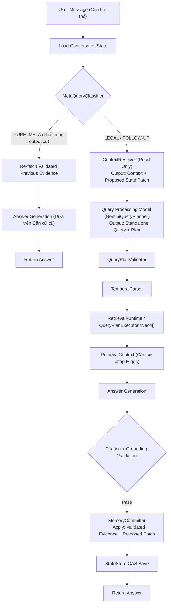

# ĐẶC TẢ KIẾN TRÚC CONTEXT MEMORY CHO HỆ THỐNG LEGAL GRAPHRAG (PHIÊN BẢN CHUẨN ĐỒ ÁN)

## 1. ĐÁNH GIÁ TỔNG THỂ VÀ ĐỊNH HƯỚNG KIẾN TRÚC

Kiến trúc mới đề xuất phân định **Ranh giới Trách nhiệm (Clean Architectural Boundaries)** vô cùng sắc bén và giải quyết triệt để 3 điểm yếu lớn của các bản phác thảo trước đó:

1. **`ContextResolver` hoàn toàn Read-Only**: Không tự ý mutate (thay đổi) trạng thái bộ nhớ quá sớm khi chưa biết kết quả Retrieval/Validation phía sau có thành công hay không.
2. **Tách biệt `ContextResolver` và `Query Processing Model`**: `ContextResolver` chỉ chịu trách nhiệm đọc trạng thái và đề xuất bản vá (`Proposed Patch`). Việc sinh `Standalone Query` và `Query Plan` được trả về đúng cho `Query Processing Model` (`GeminiQueryPlanner`).
3. **`MemoryCommitter` dựa trên Validated Evidence**: Không lấy ngây thơ `top_unit` mà kết hợp giữa các trích dẫn đã được xác minh (`Validated Evidence`) và `Proposed Patch`.

---

## 2. NGUYÊN TẮC BẤT BIẾN CỐT LÕI (SYSTEM INVARIANTS)

```text
               ┌─────────────────────────────────────────────────────────┐
               │              4 NGUYÊN TẮC BẤT BIẾN CỐT LÕI              │
               └─────────────────────────────────────────────────────────┘
                                            │
       ┌──────────────────────┬─────────────┴────────────┬──────────────────────┐
       ▼                      ▼                          ▼                      ▼
┌──────────────┐     ┌──────────────────┐       ┌─────────────────┐    ┌─────────────────┐
│ Invariant #1 │     │   Invariant #2   │       │  Invariant #3   │    │  Invariant #4   │
│ Separation of│     │ Strict Structured│       │ Post-Grounding  │    │  Deterministic  │
│  Memory &    │     │      State       │       │    CAS Commit   │    │ Expiration (TTL)│
│Legal Evidence│     └──────────────────┘       └─────────────────┘    └─────────────────┘
└──────────────┘
```

1. **Invariant #1 - Separation of Memory & Legal Evidence**: Bộ nhớ CHỈ DÙNG để hỗ trợ làm rõ câu hỏi. Bộ nhớ KHÔNG PHẢI nguồn pháp luật. Mọi khẳng định pháp lý bắt buộc phải dựa trên căn cứ được trích xuất thực tế cho từng lượt.
2. **Invariant #2 - Strict Structured State**: Bộ nhớ ưu tiên lưu trữ các thuộc tính định danh có cấu trúc (`active_document_ids`, `active_article_id`, `active_clause_id`, `active_subject_ids`).
3. **Invariant #3 - Post-Grounding CAS Commit**: Bộ nhớ CHỈ DÙNG để commit bản vá (`Proposed Patch`) SAU KHI câu trả lời đã pass kiểm định trích dẫn (`Citation + Grounding Validation`), lưu bằng giao dịch Atomic/CAS (Compare-And-Swap).
4. **Invariant #4 - Deterministic Expiration (TTL)**: Mọi thuộc tính bộ nhớ đều có metadata lượt (`set_at_turn`) và giới hạn hạn sống (TTL) để tự động hạ giải.

---

## 3. SƠ ĐỒ LUỒNG XỬ LÝ TUẦN TỰ (EXECUTION PIPELINE)



---

## 4. MA TRẬN THÀNH PHẦN KỸ THUẬT (COMPONENT SPECIFICATION)

### 4.1. `ConversationState` (Data Model)
```python
from datetime import date
from typing import Any, Generic, TypeVar
from pydantic import BaseModel

T = TypeVar("T")


class AttributeState(BaseModel, Generic[T]):
    value: T
    set_at_turn: int


class ConversationState(BaseModel):
    session_id: str
    current_turn: int = 0
    version: int = 1  # Phục vụ CAS (Compare-And-Swap) Check

    # Tầng 1: Global Legal Anchor
    active_document_ids: AttributeState[tuple[str, ...]] | None = None
    active_subject_ids: AttributeState[tuple[str, ...]] | None = None

    # Tầng 2: Local Topic Focus
    active_article_id: AttributeState[str] | None = None
    active_clause_id: AttributeState[str] | None = None

    # Cache output lượt trước cho Meta-Query
    last_answer_text: str | None = None
    last_evidence_ids: tuple[str, ...] = ()
```

---

### 4.2. `ContextResolver` (Read-Only Context Engine)
```python
class ProposedStatePatch(BaseModel):
    """Bản vá dự thảo bộ nhớ, chưa được apply vào StateStore."""

    new_active_subject: str | None = None
    reset_tier2: bool = False
    expired_fields: tuple[str, ...] = ()


class ContextResolver:
    def resolve(
        self, user_message: str, state: ConversationState
    ) -> tuple[str, ProposedStatePatch]:
        """READ-ONLY: Không làm biến đổi state ban đầu.

        Trả về chuỗi Ngữ cảnh bổ sung + Bản vá đề xuất (Proposed Patch).
        """
        # 1. Phát hiện hạ giải TTL
        expired_fields = self._compute_ttl_expirations(state)

        # 2. Phát hiện đính chính chủ thể
        new_subject = self._detect_subject_correction(user_message)
        reset_tier2 = True if new_subject else False

        # 3. Tạo đề xuất patch
        patch = ProposedStatePatch(
            new_active_subject=new_subject,
            reset_tier2=reset_tier2,
            expired_fields=expired_fields,
        )

        context_str = self._build_context_prompt_snippet(state)
        return context_str, patch
```

---

### 4.3. `MemoryCommitter` (Post-Grounding CAS Commit)
```python
class MemoryCommitter:
    def commit(
        self,
        state: ConversationState,
        patch: ProposedStatePatch,
        validated_evidence_ids: tuple[str, ...],
        answer_text: str,
    ) -> ConversationState:
        """Chỉ thực thi khi Answer Generation + Grounding Validation PASS."""
        next_turn = state.current_turn + 1
        updates: dict[str, Any] = {
            "current_turn": next_turn,
            "version": state.version + 1,
            "last_answer_text": answer_text,
            "last_evidence_ids": validated_evidence_ids,
        }

        # Áp dụng Cascade Reset nếu patch đề xuất
        if patch.reset_tier2:
            updates["active_article_id"] = None
            updates["active_clause_id"] = None

        if patch.new_active_subject:
            updates["active_subject_ids"] = AttributeState(
                value=(patch.new_active_subject,), set_at_turn=next_turn
            )

        return state.model_copy(update=updates)
```

---

## 5. KẾT LUẬN VÀ PHẠM VI TRIỂN KHAI CHO ĐỒ ÁN (MVP SCOPE)

1. **Phạm vi Triển khai Ngay (Phase 1 - Đồ án)**:
   - Triển khai `ConversationState` có cấu trúc.
   - Triển khai `ContextResolver` theo cơ chế **Read-Only**.
   - Triển khai `MemoryCommitter` theo cơ chế **Post-Grounding CAS Commit**.
   - Phân loại `MetaQueryClassifier` hỗ trợ re-fetch căn cứ cũ.

2. **Dành cho Giai đoạn Sau (Phase 2 - Future Work)**:
   - Quản lý rẽ nhánh nâng cao (`Hypothesis Branching`).
   - Tối ưu luồng Streaming đa giai đoạn.

---
*Tài liệu Đặc tả Kiến trúc Context Memory cho Hệ thống Legal GraphRAG VN.*
