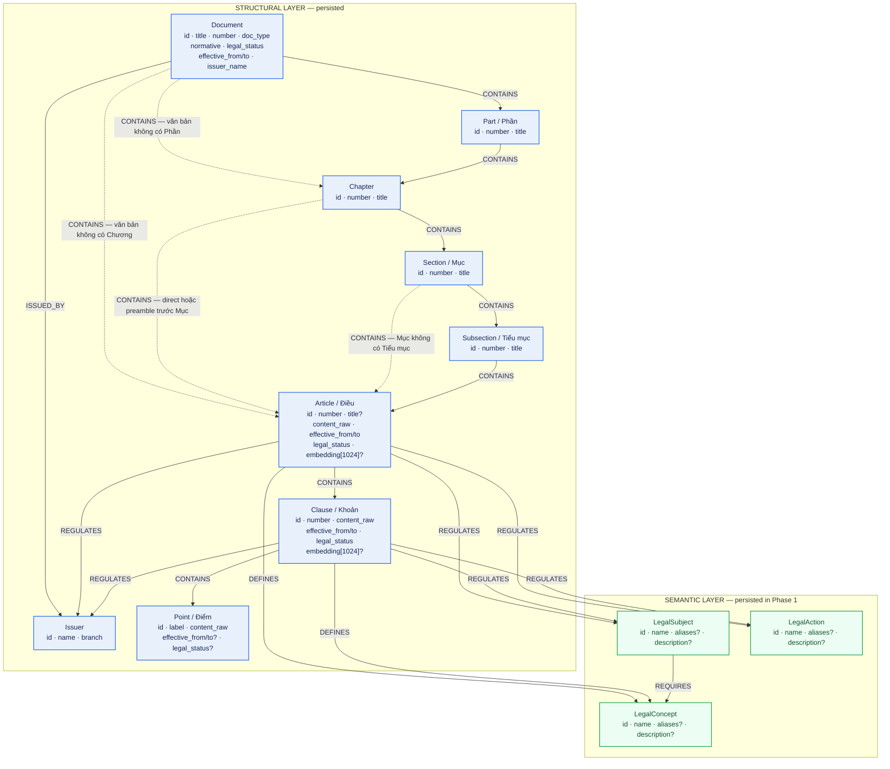
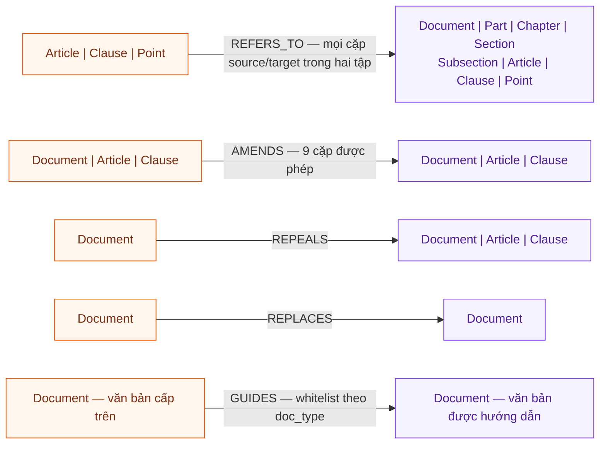
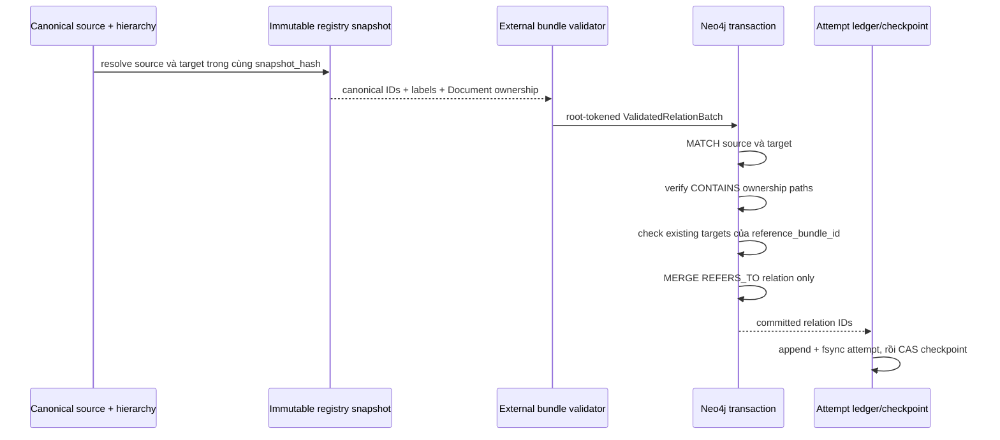

# Lược đồ Neo4j hiện tại — Legal GraphRAG VN

> **Phạm vi:** ontology và runtime contract đang có trong repository, phiên bản
> `1.9.0`.
>
> **Đã đối chiếu:** `plans/legal_ontology.md`,
> `src/shared/ontology/contract.py`, `src/shared/ontology/validators.py`,
> `src/pipeline/persistence/payload_builder.py`, các Neo4j writer/repository và
> `infra/neo4j/init/01_schema_init.cypher`.
>
> **Ngày kiểm tra:** 10/08/2026.
>
> Đây là lược đồ **được code hiện tại chấp nhận và ghi**, không phải thống kê số
> node/edge của một database live. Schema bootstrap không chứng minh dữ liệu đã
> được migrate hoặc ingest đầy đủ.

## 1. Ba lớp cần phân biệt

```text
Canonical ontology
  plans/legal_ontology.md
        │
        ▼
Application enforcement
  Pydantic + ontology validator + payload consistency validator
        │
        ▼
Physical Neo4j schema
  uniqueness constraints + indexes + stored nodes/relationships
```

Neo4j Community Edition hiện chỉ enforce uniqueness và index. Required
properties, enum, cặp endpoint, hướng quan hệ, bundle integrity và document
ownership đều do Python kiểm tra trước khi ghi.

## 2. Lược đồ node Phase 1



Bảy dạng path hierarchy tới `Article` đều canonical:

```text
Document -> Article -> Clause -> Point
Document -> Chapter -> Article -> Clause -> Point
Document -> Chapter -> Section -> Article -> Clause -> Point
Document -> Chapter -> Section -> Subsection -> Article -> Clause -> Point
Document -> Part -> Chapter -> Article -> Clause -> Point
Document -> Part -> Chapter -> Section -> Article -> Clause -> Point
Document -> Part -> Chapter -> Section -> Subsection -> Article -> Clause -> Point
```

Không có cạnh tắt `Document -> Section`, `Part -> Article` hoặc
`Chapter -> Subsection`. Mỗi structural descendant có đúng một direct canonical
parent. Cạnh flattened cũ chỉ được xóa sau khi chain thay thế đã tồn tại.

### Thuộc tính node

| Label          | Required bởi canonical validator                                                         | Optional hoặc được payload hiện tại ghi thêm                                                                        |
| -------------- | ---------------------------------------------------------------------------------------- | ------------------------------------------------------------------------------------------------------------------- |
| `Document`     | `id`, `doc_type`, `number`, `normative`, `legal_status`, `effective_from`, `issuer_name` | `title`, `issued_date`, `effective_to`, `expiry_date`, `sector`, `field`, `signer_title`, `signer_name`, `source_url`, `updated_at` |
| `Issuer`       | `id`, `name`, `branch`                                                                   | —                                                                                                                   |
| `Part`         | `id`, `number`, `title`                                                                  | —                                                                                                                   |
| `Chapter`      | `id`, `number`, `title`                                                                  | —                                                                                                                   |
| `Section`      | `id`, `number`, `title`                                                                  | —                                                                                                                   |
| `Subsection`   | `id`, `number`, `title`                                                                  | —                                                                                                                   |
| `Article`      | `id`, `number`, `content_raw`, `effective_from`, `legal_status`                          | `title`, hierarchy metadata, `effective_to`, `updated_at`, embedding + provenance                                   |
| `Clause`       | `id`, `number`, `content_raw`, `effective_from`, `legal_status`                          | `effective_to`, `updated_at`, embedding + provenance                                                               |
| `Point`        | `id`, `label`, `content_raw`                                                             | `effective_from`, `effective_to`, `legal_status`, `updated_at`                                                      |
| `LegalConcept` | `id`, `name`                                                                             | `aliases`, `description`                                                                                            |
| `LegalSubject` | `id`, `name`                                                                             | `aliases`, `description`                                                                                            |
| `LegalAction`  | `id`, `name`                                                                             | `aliases`, `description`                                                                                            |

### Ý nghĩa các thuộc tính node

Trong JSON payload, `type` là discriminator để chọn Neo4j label. Ví dụ
`{"type": "Article", ...}` được writer chuyển thành `(:Article {...})`;
`type` không phải property nghiệp vụ cần lưu trên node.

#### Identity và cấu trúc

| Property      | Kiểu dữ liệu   | Áp dụng cho                                                                 | Ý nghĩa                                                                                   | Ví dụ                                                     |
| ------------- | -------------- | --------------------------------------------------------------------------- | ----------------------------------------------------------------------------------------- | --------------------------------------------------------- |
| `id`          | `string`       | Mọi node                                                                    | Canonical ID và `MERGE` key; unique theo từng label bằng Neo4j constraint                 | `ldn_2020_art46_cl1_pa`                                   |
| `number`      | `string`       | `Document`, `Part`, `Chapter`, `Section`, `Subsection`, `Article`, `Clause` | Số hiệu pháp lý hiển thị; luôn giữ dạng chuỗi để hỗ trợ `1a`, số La Mã và số hiệu văn bản | `59/2020/QH14`, `II`, `III`, `1a`                         |
| `label`       | `string`       | `Point`                                                                     | Ký hiệu Điểm theo văn bản; `d` và `đ` là hai label khác nhau                              | `a`, `đ`                                                  |
| `title`       | `string`       | `Document`, `Part`, `Chapter`, `Section`, `Subsection`, `Article`           | Tiêu đề pháp lý/hiển thị. Bắt buộc với bốn grouping node; optional với `Article`          | `THỂ THỨC VĂN BẢN`                                        |
| `content_raw` | `string`       | `Article`, `Clause`, `Point`                                                | Nội dung canonical sau sanitize; là evidence gốc cho retrieval/citation                   | `Thành viên công ty có các quyền sau đây...`              |
| `name`        | `string`       | `Issuer`, ba semantic labels                                                | Tên hiển thị đã normalize về một entity/concept/action                                    | `Vốn điều lệ`                                             |
| `aliases`     | `list[string]` | Ba semantic labels                                                          | Các tên đồng nghĩa dùng cho entity normalization                                          | `["vốn đăng ký", "vốn góp"]`                              |
| `description` | `string`       | Ba semantic labels                                                          | Mô tả ngắn được lưu khi extraction có bằng chứng phù hợp                                  | `Tổng giá trị tài sản do thành viên góp hoặc cam kết góp` |

#### Phân loại và nguồn ban hành

| Property      | Kiểu dữ liệu | Áp dụng cho | Ý nghĩa                                                                   | Ví dụ                       |
| ------------- | ------------ | ----------- | ------------------------------------------------------------------------- | --------------------------- |
| `doc_type`    | enum string  | `Document`  | Loại văn bản canonical                                                    | `Law`, `Decree`, `Circular` |
| `normative`   | `boolean`    | `Document`  | Văn bản có thuộc corpus văn bản quy phạm hay không                        | `true`                      |
| `issuer_name` | `string`     | `Document`  | Tên cơ quan ban hành dùng để dựng `Issuer`                                | `Quốc hội`                  |
| `issued_date` | ISO date     | `Document`  | Ngày ban hành                                                             | `2020-06-17`                |
| `expiry_date` | ISO date     | `Document`  | Ngày hết hiệu lực từ metadata nguồn                                       | `2025-07-01`                |
| `sector`      | `string`     | `Document`  | Nhóm lĩnh vực nguồn                                                       | `Doanh nghiệp`              |
| `field`       | `string`     | `Document`  | Lĩnh vực chi tiết                                                         | `Thành lập doanh nghiệp`    |
| `signer_title` / `signer_name` | `string` | `Document` | Chức danh và tên người ký                                                 | `Chủ tịch Quốc hội`         |
| `source_url`  | `string`     | `Document`  | URL nguồn canonical                                                       | `https://vbpl.vn/...`       |
| `updated_at`  | datetime     | `Document`, `Article`, `Clause`, `Point` | Thời điểm cập nhật record                     | `2026-08-10T00:00:00Z`      |
| `branch`      | enum string  | `Issuer`    | Nhánh cơ quan: `LEGISLATIVE`, `EXECUTIVE`, `JUDICIAL`, `OTHER`            | `LEGISLATIVE`               |

`Document.doc_type` chấp nhận:

```text
Constitution, Law, Ordinance, Resolution, Decree,
Decision, Circular, JointCircular
```

#### Hiệu lực và embedding

| Property         | Kiểu dữ liệu            | Áp dụng cho                     | Ý nghĩa                                                                                                | Ví dụ                           |
| ---------------- | ----------------------- | ------------------------------- | ------------------------------------------------------------------------------------------------------ | ------------------------------- |
| `legal_status`   | enum string             | `Document`, `Article`, `Clause`; optional on `Point` | Trạng thái pháp lý của node                                                               | `ACTIVE`, `AMENDED`, `REPEALED` |
| `effective_from` | ISO date                | `Document`, `Article`, `Clause`; optional on `Point` | Mốc bắt đầu hiệu lực, inclusive                                                           | `2021-01-01`                    |
| `effective_to`   | ISO date, nullable      | `Document`, `Article`, `Clause`, `Point` | Mốc kết thúc hiệu lực, exclusive trong temporal filter; field thường bị omit khi chưa có ngày kết thúc | `2025-07-01`                    |
| `embedding`      | `list[float]`, nullable | `Article`, `Clause`             | Vector BGE-M3, đúng 1024 chiều; được ghi ở bước embedding sau structural write                         | `[0.012, -0.031, ...]`          |

Enum trạng thái không giống nhau giữa Document và content unit:

```text
Document:
  ACTIVE | NOT_YET_EFFECTIVE | PARTIALLY_EFFECTIVE |
  REPLACED | REPEALED | EXPIRED

Article / Clause / Point (khi Point có temporal metadata):
  ACTIVE | AMENDED | REPEALED
```

### Ví dụ data cho từng node

Đây là payload minh họa trước root validation. Optional property không có giá
trị được omit; vector 1024 chiều cũng được omit ở structural write đầu tiên.

```json
[
  {
    "type": "Document",
    "id": "ldn_2020",
    "title": "Luật Doanh nghiệp 2020",
    "number": "59/2020/QH14",
    "doc_type": "Law",
    "normative": true,
    "legal_status": "ACTIVE",
    "effective_from": "2021-01-01",
    "issuer_name": "Quốc hội",
    "issued_date": "2020-06-17"
  },
  {
    "type": "Issuer",
    "id": "quoc_hoi",
    "name": "Quốc hội",
    "branch": "LEGISLATIVE"
  },
  {
    "type": "Part",
    "id": "ldn_2020_part1",
    "number": "I",
    "title": "NHỮNG QUY ĐỊNH CHUNG"
  },
  {
    "type": "Chapter",
    "id": "ldn_2020_ch3",
    "number": "III",
    "title": "CÔNG TY TRÁCH NHIỆM HỮU HẠN"
  },
  {
    "type": "Section",
    "id": "ldn_2020_ch3_sec1",
    "number": "1",
    "title": "Công ty trách nhiệm hữu hạn hai thành viên trở lên"
  },
  {
    "type": "Subsection",
    "id": "ldn_2020_ch3_sec1_subsec1",
    "number": "1",
    "title": "QUY ĐỊNH VỀ THÀNH VIÊN"
  },
  {
    "type": "Article",
    "id": "ldn_2020_art46",
    "number": "46",
    "title": "Công ty trách nhiệm hữu hạn hai thành viên trở lên",
    "content_raw": "Công ty trách nhiệm hữu hạn hai thành viên trở lên là doanh nghiệp...",
    "effective_from": "2021-01-01",
    "legal_status": "ACTIVE"
  },
  {
    "type": "Clause",
    "id": "ldn_2020_art46_cl1",
    "number": "1",
    "content_raw": "Thành viên có thể là tổ chức, cá nhân...",
    "effective_from": "2021-01-01",
    "legal_status": "ACTIVE"
  },
  {
    "type": "Point",
    "id": "ldn_2020_art46_cl1_pa",
    "label": "a",
    "content_raw": "Thành viên chịu trách nhiệm về các khoản nợ..."
  },
  {
    "type": "LegalSubject",
    "id": "doanh_nghiep",
    "name": "Doanh nghiệp",
    "aliases": ["công ty"],
    "description": "Tổ chức có tên riêng, có tài sản và được thành lập theo pháp luật"
  },
  {
    "type": "LegalConcept",
    "id": "von_dieu_le",
    "name": "Vốn điều lệ",
    "aliases": ["vốn đăng ký", "vốn góp"],
    "description": "Tổng giá trị tài sản do thành viên góp hoặc cam kết góp"
  },
  {
    "type": "LegalAction",
    "id": "gop_von",
    "name": "Góp vốn",
    "aliases": ["đóng góp vốn"],
    "description": "Hành vi chuyển tài sản để tạo thành vốn điều lệ"
  }
]
```

Sau khi embedding chạy, node Article/Clause có thêm property dạng:

```cypher
(:Article {
  id: "ldn_2020_art46",
  embedding: <1024 floating-point values>
})
```

`Part`, `Chapter`, `Section` và `Subsection` là grouping node: không có temporal fields, full-text
index hoặc embedding. `Point` có full-text index nhưng không có embedding hoặc
temporal fields. Temporal scope của một Điểm được nâng lên `Clause` gần nhất.

## 3. Quan hệ polymorphic và temporal



Mũi tên luôn giữ hướng canonical `source -[:RELATION]-> target`:

- `AMENDS`, `REPEALS`, `REPLACES`: đơn vị/văn bản mới hơn trỏ tới đơn vị/văn
  bản cũ bị tác động.
- `GUIDES`: văn bản cấp trên trỏ tới văn bản được hướng dẫn, đồng thời cặp
  `doc_type` phải nằm trong `GUIDES_WHITELIST`.
- `REFERS_TO`: đơn vị chứa citation trỏ tới đúng endpoint pháp lý đã resolve.
  Target thuộc cùng hoặc khác `Document` vẫn dùng chung relation này.

### Ma trận quan hệ chính xác

| Relation    | Source hợp lệ                   | Target hợp lệ                                                                        | Required ontology properties                                    |
| ----------- | ------------------------------- | ------------------------------------------------------------------------------------ | --------------------------------------------------------------- |
| `ISSUED_BY` | `Document`                      | `Issuer`                                                                             | —                                                               |
| `CONTAINS`  | `Document`                      | `Part`, `Chapter`, `Article`                                                         | —                                                               |
| `CONTAINS`  | `Part`                          | `Chapter`                                                                            | —                                                               |
| `CONTAINS`  | `Chapter`                       | `Section`, `Article`                                                                 | —                                                               |
| `CONTAINS`  | `Section`                       | `Subsection`, `Article`                                                              | —                                                               |
| `CONTAINS`  | `Subsection`                    | `Article`                                                                            | —                                                               |
| `CONTAINS`  | `Article`                       | `Clause`                                                                             | —                                                               |
| `CONTAINS`  | `Clause`                        | `Point`                                                                              | —                                                               |
| `AMENDS`    | `Document`, `Article`, `Clause` | `Document`, `Article`, `Clause`                                                      | `effective_from`                                                |
| `REPEALS`   | `Document`                      | `Document`, `Article`, `Clause`                                                      | `effective_from`                                                |
| `REPLACES`  | `Document`                      | `Document`                                                                           | `effective_from`                                                |
| `GUIDES`    | `Document`                      | `Document`                                                                           | Cặp `doc_type` phải thuộc whitelist                             |
| `REFERS_TO` | `Article`, `Clause`, `Point`    | `Document`, `Part`, `Chapter`, `Section`, `Subsection`, `Article`, `Clause`, `Point` | Citation/bundle provenance và provenance theo extraction method |
| `DEFINES`   | `Article`, `Clause`             | `LegalConcept`                                                                       | `confidence`, `llm_model`, `created_at`                         |
| `REGULATES` | `Article`, `Clause`             | `LegalSubject`, `LegalAction`                                                        | `confidence`, `llm_model`, `created_at`                         |
| `REQUIRES`  | `LegalSubject`                  | `LegalConcept`                                                                       | `confidence`, `llm_model`, `created_at`                         |

`AMENDS` thực sự cho phép đủ 9 tổ hợp giữa
`Document|Article|Clause -> Document|Article|Clause`. Nó không chỉ là quan hệ
`Document -> Document` và cũng không chỉ là `Article <-> Clause`.

`REQUIRES` trong graph Phase 1 hiện là:

```text
LegalSubject -[:REQUIRES]-> LegalConcept
```

Nó **không phải** quan hệ hierarchy và không nối `Article -> Clause`. Các mô
hình `LegalSubject -> Obligation` hoặc `Obligation -> Condition` thuộc runtime/
future ontology, chưa được Phase 1 writer persist.

### Contract của `REFERS_TO`

Common required properties:

```text
citation_text
citation_type             DIRECT | INDIRECT | RANGE
extraction_method         RULE | ENTITY_LINKING | LLM
created_at
reference_bundle_id
reference_target_count
```

`DIAGRAM` thuộc provenance family riêng cho document relations
`AMENDS|REPEALS|REPLACES|GUIDES`; nó không hợp lệ trên `REFERS_TO`.

Method-specific properties:

| Method           | Required thêm                                                                                 |
| ---------------- | --------------------------------------------------------------------------------------------- |
| `RULE`           | `resolver_name`, `resolver_version`, `source_unit_id`, `source_char_start`, `source_char_end` |
| `ENTITY_LINKING` | `linker_name`, `linker_version`, `source_unit_id`, `source_char_start`, `source_char_end`     |
| `LLM`            | `confidence`, `llm_model`, `checkpoint_id`                                                    |

`relation_id` là identity deterministic mà Neo4j writer yêu cầu cho **mọi**
relation được ghi. Nó được index nhưng Neo4j Community không enforce uniqueness;
application layer kiểm tra duplicate và dùng nó làm `MERGE` key.

Với local self-reference như `khoản này`, resolver có thể xác định target chính
là source. Ontology không cấm self-loop cho `REFERS_TO`, nhưng pipeline hiện đánh
dấu `is_self_reference=true` và không materialize cạnh vô nghĩa đó.

### Ví dụ data cho relationship

Relationship payload có `head_id`, `type`, `tail_id` và `properties`.
`relation_id` dưới đây là SHA-1 deterministic được tạo bởi helper hiện hành,
không phải UUID ngẫu nhiên.

#### Hierarchy `CONTAINS`

```json
{
  "head_id": "ldn_2020_ch3",
  "type": "CONTAINS",
  "tail_id": "ldn_2020_ch3_sec1",
  "properties": {
    "relation_id": "e74a73c1a79882ca5ed03684f070b493810b5b8f"
  }
}
```

#### External `REFERS_TO`

```json
{
  "head_id": "tt_01_2021_art1",
  "type": "REFERS_TO",
  "tail_id": "ldn_2020_art46_cl1_pa",
  "properties": {
    "relation_id": "6117199003aa8580e47bc42b5e90363754ba2965",
    "citation_text": "điểm a khoản 1 Điều 46 Luật số 59/2020/QH14",
    "citation_type": "DIRECT",
    "extraction_method": "ENTITY_LINKING",
    "created_at": "2026-07-31T10:30:00+00:00",
    "reference_bundle_id": "ref_bundle_f9a4...",
    "reference_target_count": 1,
    "linker_name": "corpus-structural-registry",
    "linker_version": "1.0.0",
    "source_unit_id": "tt_01_2021_art1",
    "source_char_start": 128,
    "source_char_end": 171
  }
}
```

`source_char_start` là offset inclusive và `source_char_end` là offset exclusive
trên canonical sanitized source. Cặp `[128, 178)` phải cắt ra đúng
`citation_text`. `reference_target_count=1` nói bundle này phải có đúng một
target; với citation list, mọi target trong cùng bundle phải được validate và
ghi atomically.

#### Semantic relations

```json
[
  {
    "head_id": "ldn_2020_art4",
    "type": "DEFINES",
    "tail_id": "von_dieu_le",
    "properties": {
      "relation_id": "a1ae87041f2856076ebc38483eb2605fc8cd35bc",
      "confidence": 0.94,
      "llm_model": "gemini:gemini-flash-lite-latest",
      "created_at": "2026-07-31T10:30:00+00:00"
    }
  },
  {
    "head_id": "doanh_nghiep",
    "type": "REQUIRES",
    "tail_id": "von_dieu_le",
    "properties": {
      "relation_id": "2d282cd6a71cf9727ae9dc13e0187c3cf825293c",
      "confidence": 0.87,
      "llm_model": "gemini:gemini-flash-lite-latest",
      "created_at": "2026-07-31T10:30:00+00:00",
      "source_article": "ldn_2020_art4"
    }
  }
]
```

`confidence` là confidence của extraction record, không phải mức hiệu lực pháp
lý. `llm_model` và `created_at` lấy từ Article extraction checkpoint, không lấy
từ cấu hình/model đang chạy tại thời điểm normalize lại.

#### Temporal `AMENDS`

Ví dụ dưới đây dùng ID minh họa, không khẳng định một quan hệ sửa đổi thực tế
trong corpus:

```json
{
  "head_id": "vb_moi_art1",
  "type": "AMENDS",
  "tail_id": "vb_cu_art5",
  "properties": {
    "relation_id": "39a12d1d2d0a4f40629b2f04a3249b9d60add566",
    "effective_from": "2026-07-01"
  }
}
```

Ý nghĩa: từ `2026-07-01`, Điều 1 của văn bản mới sửa đổi Điều 5 của văn bản cũ.
Hướng cạnh không đảo thành `old -[:AMENDED_BY]-> new`.

## 4. Dẫn chiếu liên văn bản hiện được ghi thế nào



External ở đây nghĩa là target thuộc `Document` khác, không phải node bên ngoài
hệ thống. Không có `ExternalNode`, `RegistryNode` hoặc
`EXTERNAL_REFERS_TO` trong Neo4j.

Registry là filesystem artifact phục vụ identity/existence evidence; nó không
phải một tầng node trong graph. External writer:

1. `MATCH` chính xác hai endpoint đã tồn tại;
2. xác minh ownership qua `Document-[:CONTAINS*1..7]->endpoint` và exact label path;
3. yêu cầu source và target thuộc hai Document khác nhau;
4. kiểm tra target set cũ của cùng bundle ngay trong transaction;
5. chỉ `MERGE` relation `REFERS_TO`, tuyệt đối không `MERGE` node đích từ ID.

## 5. Độ sâu hierarchy và ownership

| Canonical path                                                    | Số cạnh `CONTAINS` từ Document |
| ----------------------------------------------------------------- | -----------------------------: |
| `Document -> Article`                                             |                              1 |
| `Document -> Chapter -> Article`                                  |                              2 |
| `Document -> Chapter -> Section -> Article`                       |                              3 |
| `Document -> Chapter -> Section -> Subsection -> Article`         |                              4 |
| `Document -> Part -> Chapter -> Article`                          |                              3 |
| `Document -> Part -> Chapter -> Section -> Article`               |                              4 |
| `Document -> Part -> Chapter -> Section -> Subsection -> Article` |                              5 |
| Một trong các path Article ở trên `-> Clause`                     |                       tối đa 6 |
| Một trong các path Clause ở trên `-> Point`                       |                       tối đa 7 |

Named bounds dùng chung trong runtime:

```text
MAX_DOCUMENT_TO_ARTICLE_DEPTH = 5
MAX_DOCUMENT_TO_RETRIEVAL_UNIT_DEPTH = 6
MAX_DOCUMENT_TO_CITABLE_UNIT_DEPTH = 7
MAX_DOCUMENT_HIERARCHY_DEPTH = 7
```

Depth chỉ là bound. Query vẫn phải kiểm tra label/path semantics; không được coi
mọi path dài tối đa 7 là hierarchy hợp lệ.

## 6. Physical schema trong Neo4j Community

Bootstrap hiện tạo:

| Category                    | Số lượng | Chi tiết                                                                                                                                                      |
| --------------------------- | -------: | ------------------------------------------------------------------------------------------------------------------------------------------------------------- | ------------------------------------------------ |
| Node uniqueness constraints |       12 | `id` unique cho `Document`, `Issuer`, `Part`, `Chapter`, `Section`, `Subsection`, `Article`, `Clause`, `Point`, `LegalConcept`, `LegalSubject`, `LegalAction` |
| Range/property indexes      |       28 | 12 lookup, 3 node-temporal, 3 relationship-temporal, 10 `relation_id`                                                                                         |
| Full-text indexes           |        2 | `Article                                                                                                                                                      | Clause(content_raw,title)`và`Point(content_raw)` |
| Vector indexes              |        2 | `article_embedding`, `clause_embedding`; cosine, 1024 chiều                                                                                                   |

Relationship `relation_id` indexes hiện có cho:

```text
ISSUED_BY, CONTAINS, REFERS_TO, GUIDES, AMENDS,
REPEALS, REPLACES, DEFINES, REGULATES, REQUIRES
```

Temporal relationship indexes chỉ có trên `effective_from` của `AMENDS`,
`REPEALS`, `REPLACES`.

Neo4j bootstrap không tạo property-existence constraint hoặc endpoint-type
constraint. Vì vậy một graph chỉ có đủ indexes chưa đồng nghĩa với graph đã đúng
ontology; writer phải đi qua root validator.

## 7. Runtime/future ontology không persist trong Phase 1

Các label sau hợp lệ về mặt ontology tổng quát nhưng bị root Phase 1 graph
payload validator từ chối persist:

```text
Obligation, Right, Condition, Exception
```

Do đó `HAS_CONDITION` và `HAS_EXCEPTION` không có relation index và không xuất
hiện trong lược đồ persisted Phase 1. Chúng chỉ được thêm khi có một runtime
reasoning component và một migration contract riêng.

## 8. Kết quả kiểm tra contract parity

`Article.title` là optional thống nhất trong canonical plan, root validator và
`NODE_REQUIRED_FIELDS`. `Part`, `Chapter`, `Section`, `Subsection` bắt buộc có
title. Physical schema chỉ enforce uniqueness; property requirement vẫn do
application validation kiểm tra trước write.

## 9. Kết luận dùng trong report

> Neo4j runtime contract cho phép persist 12 label Phase 1, gồm hierarchy linh hoạt
> bảy canonical path `Document -> ... -> Article -> Clause -> Point`, ba semantic
> label `LegalConcept`, `LegalSubject`, `LegalAction`, và 10 loại relation được
> index theo deterministic `relation_id`. `REFERS_TO` là relation polymorphic từ
> `Article|Clause|Point` tới mọi structural endpoint; dẫn chiếu khác văn bản vẫn
> nối trực tiếp hai canonical node đã tồn tại, sau khi registry và Neo4j writer
> cùng xác minh identity, ownership và bundle integrity. Neo4j Community chỉ
> enforce uniqueness/index; tính đúng ontology được enforce ở Python trước write.
