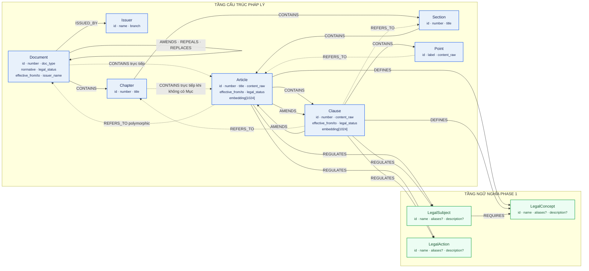

# Lược đồ cơ sở dữ liệu Neo4j hiện tại

> **Phạm vi:** schema contract Phase 1 của Legal GraphRAG, ontology v1.7.0.
>
> **Đối chiếu:** `plans/legal_ontology.md`, `src/shared/ontology/contract.py`,
> `infra/neo4j/init/01_schema_init.cypher`, và Neo4j writer.
>
> **Ngày kiểm tra:** 31/07/2026. Đây là lược đồ contract trong repository,
> không phải snapshot số lượng node của database live vì hiện không có container
> Neo4j graph-RAG đang chạy.

## Hình: Lược đồ node và quan hệ

**Chú thích hình.** Mũi tên giữ đúng hướng canonical
`source -[:RELATION]-> target`. Các cạnh `REFERS_TO` trong hình là đường đại
diện; endpoint đầy đủ được liệt kê trong bảng dưới. Dấu `?` là thuộc tính tùy
chọn. `Article` và `Clause` dùng vector BGE-M3 1024 chiều; `Point` không có
embedding. `Chapter` và `Section` là node grouping cấu trúc, không có temporal
fields, full-text index hoặc embedding.

`REFERS_TO` là polymorphic theo ma trận endpoint, không phải chỉ ba cặp minh họa
trong hình. Canonical direction luôn là đơn vị nguồn
`-[:REFERS_TO]->` đơn vị đích đã resolve duy nhất.

## Ma trận quan hệ đầy đủ

| Quan hệ | Source | Target | Thuộc tính bắt buộc chính |
|---|---|---|---|
| `ISSUED_BY` | `Document` | `Issuer` | `relation_id` khi ghi |
| `CONTAINS` | `Document` | `Chapter`, `Article` | `relation_id` khi ghi |
| `CONTAINS` | `Chapter` | `Section`, `Article` | `relation_id` khi ghi |
| `CONTAINS` | `Section` | `Article` | `relation_id` khi ghi |
| `CONTAINS` | `Article` | `Clause` | `relation_id` khi ghi |
| `CONTAINS` | `Clause` | `Point` | `relation_id` khi ghi |
| `GUIDES` | `Document` | `Document` | cặp loại văn bản phải thuộc whitelist |
| `AMENDS` | `Document`, `Article`, `Clause` | `Document`, `Article`, `Clause` | `effective_from` |
| `REPEALS` | `Document` | `Document`, `Article`, `Clause` | `effective_from` |
| `REPLACES` | `Document` | `Document` | `effective_from` |
| `REFERS_TO` | `Article`, `Clause`, `Point` | `Document`, `Chapter`, `Section`, `Article`, `Clause`, `Point` | citation, extraction method, bundle provenance và method-specific provenance |
| `DEFINES` | `Article`, `Clause` | `LegalConcept` | `confidence`, `llm_model`, `created_at` |
| `REGULATES` | `Article`, `Clause` | `LegalSubject`, `LegalAction` | `confidence`, `llm_model`, `created_at` |
| `REQUIRES` | `LegalSubject` | `LegalConcept` | `confidence`, `llm_model`, `created_at` |

`relation_id` là khóa định danh quan hệ deterministic dùng trong lệnh `MERGE`.
Neo4j Community chỉ index thuộc tính này; tính duy nhất của quan hệ được kiểm tra
ở application layer.

## Physical schema trong Neo4j Community

| Thành phần | Trạng thái hiện tại |
|---|---|
| Uniqueness constraints | 10 constraint trên `id` của 10 label Phase 1 |
| Lookup/temporal indexes | `Document`, `Article`, `Clause`, `Issuer` và ba semantic labels |
| Relationship indexes | `relation_id` cho 10 loại quan hệ Phase 1; `effective_from` cho `AMENDS`, `REPEALS`, `REPLACES` |
| Full-text indexes | `Article|Clause(content_raw,title)` và `Point(content_raw)` |
| Vector indexes | `article_embedding`, `clause_embedding`; cosine, 1024 chiều |
| Property/type enforcement | Python ontology validator trước mọi `MERGE`, không phải Neo4j Community |

Các label `Obligation`, `Right`, `Condition`, `Exception` và quan hệ
`HAS_CONDITION`, `HAS_EXCEPTION` thuộc runtime/future phase. Chúng hợp lệ trong
ontology tổng quát nhưng **không thuộc tập persist Phase 1 hiện tại**, vì vậy
không xuất hiện như bảng/node đang lưu trong hình.

## Ghi chú contract drift cần xử lý

`plans/legal_ontology.md` xem `Article.title` là tùy chọn, trong khi
`src/shared/ontology/contract.py` hiện đưa `title` vào danh sách field bắt buộc.
Hình biểu diễn `title` vì write-time validator hiện hành yêu cầu nó; báo cáo nên
ghi nhận đây là sai lệch contract cần được thống nhất, không coi đó là constraint
do Neo4j tự enforce.
