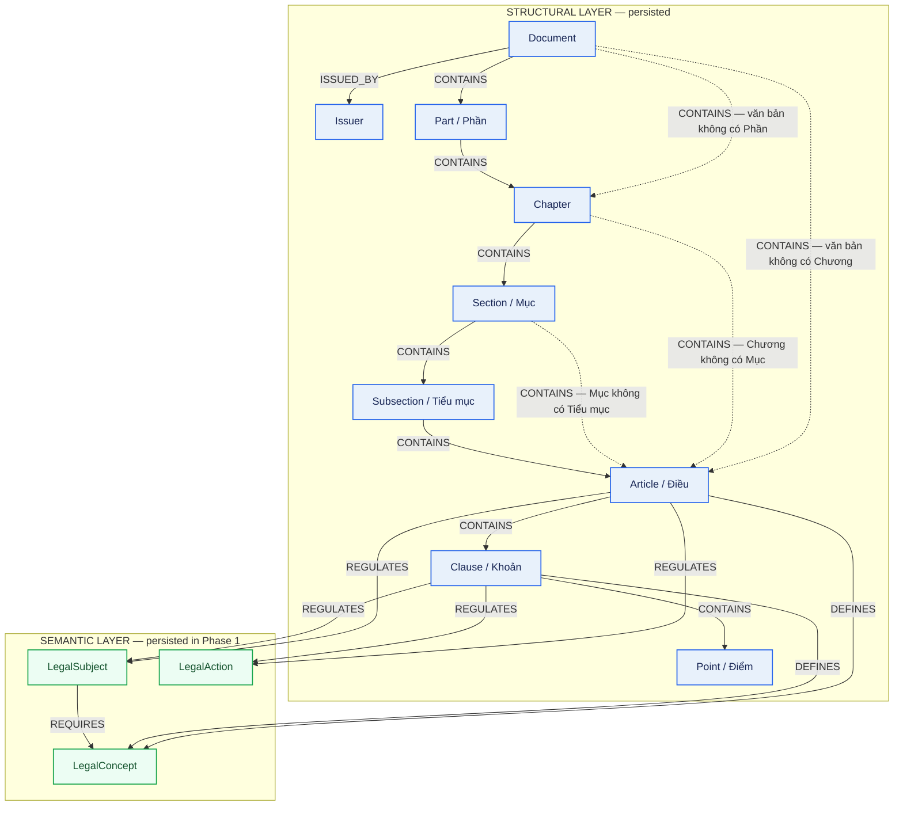

# Lược đồ Neo4j — Node & Edge (Legal GraphRAG VN)

> **Phiên bản ontology:** `1.8.0`
> **Nguồn đối chiếu:** `src/shared/ontology/contract.py`,
> `infra/neo4j/init/01_schema_init.cypher`, `docs/report/neo4j_database_schema.md`.
> **Phạm vi:** 12 label được Phase 1 writer persist (9 structural + 3 semantic).

## 1. Sơ đồ tổng thể

> **Ghi chú:** cạnh nét đứt là các "shortcut" hợp lệ khi văn bản thiếu một tầng
> phân cấp (không có Phần / không có Chương / không có Mục / không có Tiểu mục).
> Mỗi structural descendant vẫn có đúng một direct canonical parent.
> Neo4j Community chỉ enforce uniqueness + index; ràng buộc required/enum/endpoint
> được validate ở tầng Python trước khi ghi.

---

## 2. Thuộc tính của từng Node

Cột **Ràng buộc**: `PK` = MERGE key (unique constraint theo label); `NOT NULL` =
required field bắt buộc; `NULL` = optional; `enum` = giới hạn tập giá trị.

### 2.1. `Document` — Văn bản

| Tên cột | Kiểu dữ liệu | Ràng buộc | Giải thích |
|---|---|---|---|
| `id` | string | PK, NOT NULL | Canonical ID / MERGE key, unique theo label. VD `ldn_2020` |
| `doc_type` | enum string | NOT NULL, enum | Loại văn bản: `Constitution, Law, Ordinance, Resolution, Decree, Decision, Circular, JointCircular` |
| `number` | string | NOT NULL | Số hiệu văn bản (giữ chuỗi). VD `59/2020/QH14` |
| `normative` | boolean | NOT NULL | Có thuộc corpus văn bản quy phạm hay không |
| `legal_status` | enum string | NOT NULL, enum | `ACTIVE, NOT_YET_EFFECTIVE, PARTIALLY_EFFECTIVE, REPLACED, REPEALED, EXPIRED` |
| `effective_from` | ISO date | NOT NULL | Mốc bắt đầu hiệu lực (inclusive) |
| `issuer_name` | string | NOT NULL | Tên cơ quan ban hành, dùng để MERGE `Issuer` |
| `title` | string | NULL | Tiêu đề hiển thị |
| `effective_to` | ISO date | NULL | Mốc kết thúc hiệu lực (exclusive); omit khi chưa có |
| `issued_by` | string | NULL | Tên cơ quan từ parser/source |
| `issued_date` | ISO date | NULL | Ngày ban hành |
| `source_url` / `document_uri` | string | NULL | Nguồn/URI gốc |
| `jurisdiction` | string | NULL | Phạm vi thẩm quyền |
| `gazette_number` | string | NULL | Số công báo |

### 2.2. `Issuer` — Cơ quan ban hành

| Tên cột | Kiểu dữ liệu | Ràng buộc | Giải thích |
|---|---|---|---|
| `id` | string | PK, NOT NULL | Slug định danh (MERGE theo `id`, không phải `name`) |
| `name` | string | NOT NULL | Tên hiển thị đã normalize. VD `Quốc hội` |
| `branch` | enum string | NOT NULL, enum | `LEGISLATIVE, EXECUTIVE, JUDICIAL, OTHER` |

### 2.3. `Part` / `Chapter` / `Section` / `Subsection` — Nhóm phân cấp

Bốn grouping node dùng chung bộ thuộc tính (không có temporal / embedding / full-text).

| Tên cột | Kiểu dữ liệu | Ràng buộc | Giải thích |
|---|---|---|---|
| `id` | string | PK, NOT NULL | Canonical ID / MERGE key |
| `number` | string | NOT NULL | Số hiệu (Phần dùng số La Mã, ...) |
| `title` | string | NOT NULL | Tiêu đề pháp lý (bắt buộc với cả 4 node nhóm) |

### 2.4. `Article` — Điều

| Tên cột | Kiểu dữ liệu | Ràng buộc | Giải thích |
|---|---|---|---|
| `id` | string | PK, NOT NULL | Canonical ID / MERGE key. VD `ldn_2020_art46` |
| `number` | string | NOT NULL | Số Điều (giữ chuỗi để hỗ trợ `1a`) |
| `content_raw` | string | NOT NULL | Nội dung canonical sau sanitize; evidence gốc |
| `effective_from` | ISO date | NOT NULL | Mốc bắt đầu hiệu lực |
| `legal_status` | enum string | NOT NULL, enum | `ACTIVE, AMENDED, REPEALED` |
| `title` | string | NULL | Tiêu đề Điều (optional) |
| `effective_to` | ISO date | NULL | Mốc kết thúc hiệu lực |
| `embedding` | list[float] | NULL | Vector BGE-M3, đúng 1024 chiều; fill ở bước embedding sau |

### 2.5. `Clause` — Khoản

| Tên cột | Kiểu dữ liệu | Ràng buộc | Giải thích |
|---|---|---|---|
| `id` | string | PK, NOT NULL | Canonical ID / MERGE key. VD `ldn_2020_art46_cl1` |
| `number` | string | NOT NULL | Số Khoản |
| `content_raw` | string | NOT NULL | Nội dung canonical sau sanitize |
| `effective_from` | ISO date | NOT NULL | Mốc bắt đầu hiệu lực |
| `legal_status` | enum string | NOT NULL, enum | `ACTIVE, AMENDED, REPEALED` |
| `effective_to` | ISO date | NULL | Mốc kết thúc hiệu lực |
| `embedding` | list[float] | NULL | Vector BGE-M3, 1024 chiều |

### 2.6. `Point` — Điểm

| Tên cột | Kiểu dữ liệu | Ràng buộc | Giải thích |
|---|---|---|---|
| `id` | string | PK, NOT NULL | Canonical ID / MERGE key |
| `label` | string | NOT NULL | Ký hiệu Điểm; `d` và `đ` là hai label khác nhau |
| `content_raw` | string | NOT NULL | Nội dung; có full-text index nhưng không có embedding/temporal |

### 2.7. `LegalConcept` / `LegalSubject` / `LegalAction` — Semantic node

Ba semantic label dùng chung bộ thuộc tính.

| Tên cột | Kiểu dữ liệu | Ràng buộc | Giải thích |
|---|---|---|---|
| `id` | string | PK, NOT NULL | Canonical ID / MERGE key |
| `name` | string | NOT NULL | Tên đã normalize về một entity/concept/action |
| `aliases` | list[string] | NULL | Các tên đồng nghĩa dùng cho entity normalization |
| `description` | string | NULL | Mô tả ngắn được lưu khi extraction có bằng chứng |

---

## 3. Thuộc tính chứa trong các cạnh (Edge)

Mọi cạnh đều có `relation_id` (SHA-1 deterministic) làm identity + MERGE key.
Community Edition không enforce uniqueness cho relationship → Python kiểm tra duplicate.

### 3.1. Cạnh cấu trúc — không có property nghiệp vụ

| Relation | Source → Target | Property | Kiểu dữ liệu | Ràng buộc | Giải thích |
|---|---|---|---|---|---|
| `ISSUED_BY` | Document → Issuer | `relation_id` | string | NOT NULL, indexed | Identity/MERGE key; không có property khác |
| `CONTAINS` | (phân cấp hợp lệ) | `relation_id` | string | NOT NULL, indexed | Quan hệ chứa cấu trúc; endpoint validate ở Python |

Các cặp `CONTAINS` hợp lệ: `Document→{Part,Chapter,Article}`, `Part→Chapter`,
`Chapter→{Section,Article}`, `Section→{Subsection,Article}`, `Subsection→Article`,
`Article→Clause`, `Clause→Point`.

### 3.2. Cạnh temporal — `AMENDS` / `REPEALS` / `REPLACES`

| Tên cột | Kiểu dữ liệu | Ràng buộc | Giải thích |
|---|---|---|---|
| `relation_id` | string | NOT NULL, indexed | Identity/MERGE key |
| `effective_from` | ISO date | NOT NULL, indexed | Mốc hiệu lực của tác động; source (mới) → target (cũ) |

- `AMENDS`: `Document|Article|Clause → Document|Article|Clause` (đủ 9 tổ hợp).
- `REPEALS`: `Document → Document|Article|Clause`.
- `REPLACES`: `Document → Document`.
- Hướng canonical: đơn vị/văn bản **mới hơn** trỏ tới đơn vị/văn bản **cũ** bị tác động.

### 3.3. Cạnh `GUIDES` — hướng dẫn

| Tên cột | Kiểu dữ liệu | Ràng buộc | Giải thích |
|---|---|---|---|
| `relation_id` | string | NOT NULL, indexed | Identity/MERGE key |

- `GUIDES`: `Document → Document`, cặp `doc_type` phải nằm trong `GUIDES_WHITELIST`
  (VD `Law→Decree`, `Decree→Circular`, ...).

### 3.4. Cạnh semantic — `DEFINES` / `REGULATES` / `REQUIRES`

Chung bộ property provenance của extraction record.

| Tên cột | Kiểu dữ liệu | Ràng buộc | Giải thích |
|---|---|---|---|
| `relation_id` | string | NOT NULL, indexed | Identity/MERGE key |
| `confidence` | float | NOT NULL | Confidence của extraction record (không phải mức hiệu lực pháp lý) |
| `llm_model` | string | NOT NULL | Model tạo record, lấy từ Article extraction checkpoint |
| `created_at` | datetime | NOT NULL | Thời điểm tạo record |
| `source_article` | string | NULL | (Chỉ `REQUIRES`) Article gốc suy ra quan hệ |

- `DEFINES`: `Article|Clause → LegalConcept`.
- `REGULATES`: `Article|Clause → LegalSubject|LegalAction` (contract còn cho phép `Issuer`).
- `REQUIRES`: `LegalSubject → LegalConcept` (không phải hierarchy, không nối `Article→Clause`).

### 3.5. Cạnh `REFERS_TO` — dẫn chiếu (polymorphic)

Source: `Article|Clause|Point`. Target: `Article|Clause|Point|Document|Part|Chapter|Section|Subsection`.

**Common required properties:**

| Tên cột | Kiểu dữ liệu | Ràng buộc | Giải thích |
|---|---|---|---|
| `relation_id` | string | NOT NULL, indexed | Identity/MERGE key |
| `citation_text` | string | NOT NULL | Chuỗi trích dẫn gốc |
| `citation_type` | enum string | NOT NULL, enum | `DIRECT, INDIRECT, RANGE` |
| `extraction_method` | enum string | NOT NULL, enum | `RULE, ENTITY_LINKING, LLM` |
| `created_at` | datetime | NOT NULL | Thời điểm tạo |
| `reference_bundle_id` | string | NOT NULL | ID bundle dẫn chiếu (atomic per bundle) |
| `reference_target_count` | integer | NOT NULL | Số target trong bundle |

**Property bổ sung theo `extraction_method`:**

| Tên cột | Kiểu dữ liệu | Ràng buộc | Giải thích |
|---|---|---|---|
| `resolver_name` | string | NOT NULL (RULE) | Tên resolver |
| `resolver_version` | string | NOT NULL (RULE) | Phiên bản resolver |
| `linker_name` | string | NOT NULL (ENTITY_LINKING) | Tên linker |
| `linker_version` | string | NOT NULL (ENTITY_LINKING) | Phiên bản linker |
| `source_unit_id` | string | NOT NULL (RULE, ENTITY_LINKING) | Unit chứa citation |
| `source_char_start` | integer | NOT NULL (RULE, ENTITY_LINKING) | Offset inclusive trên source sanitized |
| `source_char_end` | integer | NOT NULL (RULE, ENTITY_LINKING) | Offset exclusive; `[start,end)` cắt đúng `citation_text` |
| `confidence` | float | NOT NULL (LLM) | Confidence của LLM extraction |
| `llm_model` | string | NOT NULL (LLM) | Model dùng để extract |
| `checkpoint_id` | string | NOT NULL (LLM) | Checkpoint của extraction |

---

## 4. Physical schema (Neo4j Community)

| Loại | Số lượng | Chi tiết |
|---|---:|---|
| Node uniqueness constraints | 12 | `id` unique cho toàn bộ 12 label |
| Range/property indexes | 28 | 12 lookup + 3 node-temporal + 3 relationship-temporal + 10 `relation_id` |
| Full-text indexes | 2 | `Article\|Clause(content_raw,title)`, `Point(content_raw)` |
| Vector indexes | 2 | `article_embedding`, `clause_embedding` — cosine, 1024 chiều |

> Bootstrap **không** tạo property-existence hoặc endpoint-type constraint.
> Tính đúng ontology (required, enum, endpoint, hướng cạnh, bundle integrity)
> được enforce ở tầng Python trước khi write.
