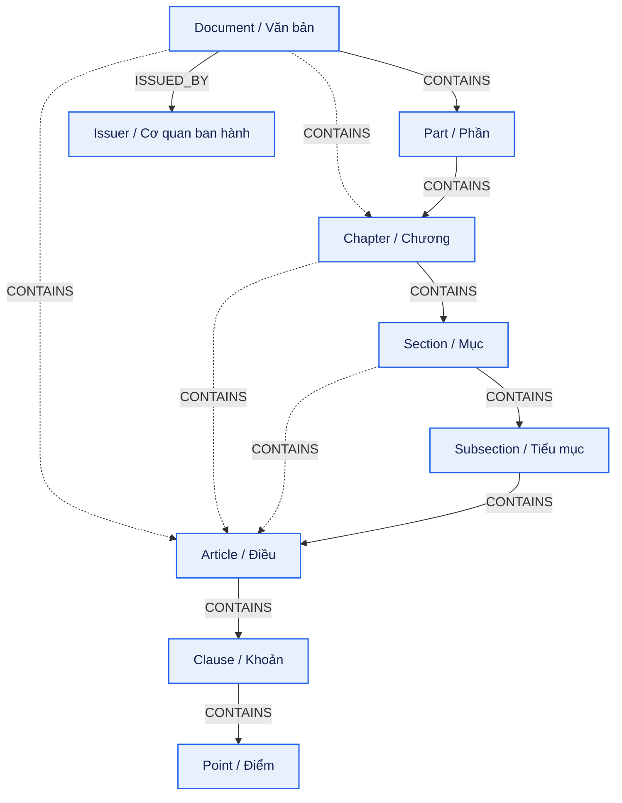
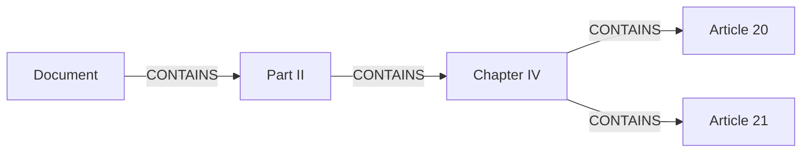

# Cấu trúc và quan hệ của văn bản quy phạm pháp luật trong Legal GraphRAG VN

> **Mục đích:** mô tả cấu trúc pháp lý của văn bản quy phạm pháp luật (VBPL),
> cách ánh xạ cấu trúc đó sang Neo4j và trạng thái hỗ trợ của repository.
>
> **Ngày đối chiếu:** 10/08/2026.
>
> **Trạng thái:** ontology/runtime contract hiện tại là `v1.9.0`; `Part`,
> `Subsection`, Chapter preamble Articles và diagram provenance đã được đồng bộ. Việc
> một database live cụ thể đã được reparse/migrate hay chưa phải được xác minh
> riêng.
>
> **Tài liệu liên quan:** [lược đồ Neo4j hiện tại](neo4j_database_schema.md),
> [canonical ontology v1.9.0](../../plans/legal_ontology.md),
> [Plan 18](../../plans/agent-plan-feats/18_part_and_subsection_hierarchy_plan.md).

## 1. Cơ sở mô hình hóa

### 1.1 Quy định lịch sử

[Điều 62 Nghị định 34/2016/NĐ-CP](https://luatvietnam.vn/hanh-chinh/nghi-dinh-34-2016-nd-cp-huong-dan-luat-ban-hanh-van-ban-quy-pham-phap-luat-105351-d1.html)
liệt kê trực tiếp sáu bố cục:

```text
1. Phần -> Chương -> Mục -> Tiểu mục -> Điều -> Khoản -> Điểm
2. Phần -> Chương -> Mục -> Điều -> Khoản -> Điểm
3. Chương -> Mục -> Tiểu mục -> Điều -> Khoản -> Điểm
4. Chương -> Mục -> Điều -> Khoản -> Điểm
5. Chương -> Điều -> Khoản -> Điểm
6. Điều -> Khoản -> Điểm
```

Nghị định này đã được thay thế. Sáu bố cục trên được dùng làm bằng chứng lịch
sử và fixture parser, không được trình bày như authority hiện hành.

### 1.2 Quy định hiện hành

[Điều 63 Nghị định 78/2025/NĐ-CP](https://xaydungchinhsach.chinhphu.vn/toan-van-nghi-dinh-78-2025-nd-cp-quy-dinh-chi-tiet-mot-so-dieu-luat-ban-hanh-van-ban-quy-pham-phap-luat-119250408202647634.htm)
mô tả cấu trúc theo quy tắc kết hợp:

```text
Văn bản -> Phần hoặc Chương hoặc Điều trực tiếp
Phần    -> Chương
Chương  -> Mục hoặc không có Mục
Mục     -> Tiểu mục hoặc không có Tiểu mục
Điều    -> Khoản hoặc không có Khoản
Khoản   -> Điểm hoặc không có Điểm
```

Do `Chương` có thể không có `Mục`, một Chương nằm trong Phần có thể chứa Điều
trực tiếp:

```text
Document -> Part -> Chapter -> Article
```

Đây là đường cấu trúc thứ bảy cần được ontology mục tiêu hỗ trợ.

## 2. Ánh xạ thuật ngữ pháp lý sang node

| Thuật ngữ VBPL | Neo4j label | Vai trò | Runtime v1.9.0 |
|---|---|---|---|
| Văn bản | `Document` | Root của một văn bản canonical | Có |
| Cơ quan ban hành | `Issuer` | Chủ thể ban hành văn bản | Có |
| Phần | `Part` | Nhóm cấu trúc lớn nhất trong nội dung | Có |
| Chương | `Chapter` | Nhóm Điều theo chủ đề lớn | Có |
| Mục | `Section` | Nhóm Điều trong một Chương | Có |
| Tiểu mục | `Subsection` | Nhóm Điều trong một Mục | Có |
| Điều | `Article` | Đơn vị quy phạm chính | Có |
| Khoản | `Clause` | Đơn vị con của Điều | Có |
| Điểm | `Point` | Đơn vị con của Khoản | Có |

`Part`, `Chapter`, `Section` và `Subsection` là grouping node. Chúng phục vụ
hierarchy, navigation, ownership và làm endpoint cho dẫn chiếu. Chúng không được
embed và không tự mang temporal fields trong thiết kế này.

## 3. Sơ đồ cấu trúc mục tiêu



Chú thích:

- node xanh: runtime contract `v1.9.0` đã hỗ trợ;
- cạnh nét liền: đường phân cấp sâu;
- cạnh nét đứt: đường trực tiếp hợp lệ khi tầng trung gian không xuất hiện;
  riêng Chapter còn có thể chứa preamble Article trước các Section.

## 4. Bảy canonical parent chains tới Điều

| # | Canonical path tới `Article` | Nguồn quy tắc |
|---|---|---|
| 1 | `Document -> Part -> Chapter -> Section -> Subsection -> Article` | Bố cục lịch sử được liệt kê trực tiếp |
| 2 | `Document -> Part -> Chapter -> Section -> Article` | Bố cục lịch sử được liệt kê trực tiếp |
| 3 | `Document -> Part -> Chapter -> Article` | Suy ra từ quy tắc hiện hành: Chapter có thể không có Section |
| 4 | `Document -> Chapter -> Section -> Subsection -> Article` | Bố cục lịch sử được liệt kê trực tiếp |
| 5 | `Document -> Chapter -> Section -> Article` | Bố cục lịch sử được liệt kê trực tiếp |
| 6 | `Document -> Chapter -> Article` | Bố cục lịch sử được liệt kê trực tiếp |
| 7 | `Document -> Article` | Bố cục lịch sử được liệt kê trực tiếp |

Đây là bảy đường cha tới `Article`, không phải bảy biến thể bắt buộc chứa đủ
`Clause` và `Point`. Hai tầng cuối là tùy chọn:

```text
Article -> Clause        hoặc Article không có Clause
Clause  -> Point         hoặc Clause không có Point
```

## 5. Ma trận `CONTAINS` mục tiêu

| Source | Target hợp lệ | Ý nghĩa |
|---|---|---|
| `Document` | `Part` | Văn bản được chia thành các Phần |
| `Document` | `Chapter` | Văn bản không có Phần, bắt đầu bằng Chương |
| `Document` | `Article` | Văn bản không có Phần và Chương |
| `Part` | `Chapter` | Một Phần chứa các Chương |
| `Chapter` | `Section` | Chương được chia thành các Mục |
| `Chapter` | `Article` | Chương không có Mục, hoặc Điều mở đầu đứng trước mọi Điều thuộc Mục |
| `Section` | `Subsection` | Mục được chia thành các Tiểu mục |
| `Section` | `Article` | Mục không có Tiểu mục |
| `Subsection` | `Article` | Tiểu mục chứa các Điều |
| `Article` | `Clause` | Điều được chia thành các Khoản |
| `Clause` | `Point` | Khoản được chia thành các Điểm |

Các cặp sau không canonical:

```text
Document -> Section
Document -> Subsection
Part -> Section
Part -> Article
Chapter -> Subsection
Subsection -> Clause
Article -> Point
```

Không tạo cạnh tắt chỉ để query ngắn hơn. Ownership phải được xác minh qua đúng
canonical `CONTAINS` path.

## 6. Quy tắc parent và composition mode

### 6.1 Một direct parent duy nhất

| Node | Direct parent hợp lệ |
|---|---|
| `Part` | `Document` |
| `Chapter` | `Document` hoặc `Part` |
| `Section` | `Chapter` |
| `Subsection` | `Section` |
| `Article` | `Document`, `Chapter`, `Section` hoặc `Subsection` |
| `Clause` | `Article` |
| `Point` | `Clause` |

Một structural node chỉ có đúng một direct structural parent. Ví dụ, khi Điều
77 thuộc Tiểu mục 1 thì chỉ tạo:

```text
Subsection 1 -[:CONTAINS]-> Article 77
```

Không đồng thời tạo thêm `Section 3 -> Article 77` hoặc
`Chapter V -> Article 77`.

### 6.2 Một child mode cho mỗi grouping parent

```text
Document -> Part children | Chapter children | Article children
Part     -> Chapter children
Chapter  -> Section children | Article children
Section  -> Subsection children | Article children
```

Dấu `|` biểu thị lựa chọn. Một parent cụ thể không trộn hai mode trên cùng dòng.
Ví dụ, một `Section` đã được chia thành `Subsection` thì các Điều của Section đó
phải nằm dưới Subsection tương ứng, không đồng thời có direct Article children.

## 7. Các quan hệ ngoài hierarchy

### 7.1 Tổng quan

| Relation | Source | Target | Vai trò |
|---|---|---|---|
| `ISSUED_BY` | `Document` | `Issuer` | Xác định cơ quan ban hành |
| `REFERS_TO` | `Article`, `Clause`, `Point` | Structural endpoint | Dẫn chiếu pháp lý đã resolve và xác minh |
| `AMENDS` | `Document`, `Article`, `Clause` | `Document`, `Article`, `Clause` theo allowlist | Sửa đổi đơn vị cũ |
| `REPEALS` | `Document` | `Document`, `Article`, `Clause` | Bãi bỏ văn bản/đơn vị |
| `REPLACES` | `Document` | `Document` | Thay thế toàn bộ văn bản |
| `GUIDES` | `Document` | `Document` | Văn bản hướng dẫn văn bản khác |
| `DEFINES` | `Article`, `Clause` | `LegalConcept` | Định nghĩa khái niệm |
| `REGULATES` | `Article`, `Clause` | `LegalSubject`, `LegalAction` | Điều chỉnh chủ thể/hành vi |
| `REQUIRES` | `LegalSubject` | `LegalConcept` | Yêu cầu một khái niệm/điều kiện pháp lý ở Phase 1 |

`Part` và `Subsection` là target hợp lệ của `REFERS_TO`; chúng không
trở thành source citation trong Plan 18. Source vẫn là đơn vị có nội dung:

```text
Article | Clause | Point
```

### 7.2 `REFERS_TO` polymorphic

Runtime `v1.9.0` cho phép target:

```text
Document | Part | Chapter | Section | Subsection | Article | Clause | Point
```

Ví dụ local reference:

```text
Clause 2 Article 89
  -[:REFERS_TO]-> Section 1 Chapter III
```

Ví dụ external reference:

```text
Circular A.Article 1
  -[:REFERS_TO]->
Decree 57/2026.Article 8.Clause 3.Point d
```

“External” nghĩa là target thuộc Document khác, không phải node nằm ngoài hệ
thống hoặc URL ngoài Neo4j.

### 7.3 Quy tắc materialize external reference

```text
accepted hierarchy
-> immutable registry snapshot
-> resolve đúng một source và một target
-> Neo4j MATCH lại hai endpoint và Document ownership
-> MERGE REFERS_TO relation duy nhất
```

Không được:

```text
đọc citation
-> tự ghép target ID
-> MERGE target node
```

ID deterministic vẫn được sử dụng, nhưng chỉ registry record được tạo từ
hierarchy đã accepted mới chứng minh endpoint tồn tại.

## 8. Ví dụ dữ liệu cấu trúc đầy đủ

### 8.1 Node payload minh họa

Ví dụ dưới đây là fixture synthetic đúng contract `v1.9.0`; nó không đại diện
cho một văn bản có thật và không chứng minh database live đã chạy migration.

```json
[
  {
    "type": "Document",
    "id": "demo_vbpl",
    "number": "DEMO/REPORT",
    "doc_type": "Law",
    "normative": true,
    "legal_status": "ACTIVE",
    "effective_from": "2026-01-01",
    "issuer_name": "Cơ quan minh họa"
  },
  {
    "type": "Part",
    "id": "demo_vbpl_part2",
    "number": "II",
    "title": "QUY ĐỊNH CHUYÊN NGÀNH"
  },
  {
    "type": "Chapter",
    "id": "demo_vbpl_ch5",
    "number": "V",
    "title": "TỔ CHỨC THỰC HIỆN"
  },
  {
    "type": "Section",
    "id": "demo_vbpl_ch5_sec3",
    "number": "3",
    "title": "QUY TRÌNH"
  },
  {
    "type": "Subsection",
    "id": "demo_vbpl_ch5_sec3_subsec1",
    "number": "1",
    "title": "TRÌNH TỰ THỰC HIỆN"
  },
  {
    "type": "Article",
    "id": "demo_vbpl_art10",
    "number": "10",
    "title": "Trình tự thực hiện",
    "content_raw": "Trình tự thực hiện được quy định như sau...",
    "effective_from": "2026-01-01",
    "legal_status": "ACTIVE"
  },
  {
    "type": "Clause",
    "id": "demo_vbpl_art10_cl1",
    "number": "1",
    "content_raw": "Cơ quan có trách nhiệm tiếp nhận hồ sơ...",
    "effective_from": "2026-01-01",
    "legal_status": "ACTIVE"
  }
]
```

Pipeline thật phải lấy title, nội dung và trạng thái từ canonical
source/metadata đã validate.

### 8.2 Relationship payload minh họa

```json
[
  {
    "type": "CONTAINS",
    "source_id": "demo_vbpl",
    "target_id": "demo_vbpl_part2"
  },
  {
    "type": "CONTAINS",
    "source_id": "demo_vbpl_part2",
    "target_id": "demo_vbpl_ch5"
  },
  {
    "type": "CONTAINS",
    "source_id": "demo_vbpl_ch5",
    "target_id": "demo_vbpl_ch5_sec3"
  },
  {
    "type": "CONTAINS",
    "source_id": "demo_vbpl_ch5_sec3",
    "target_id": "demo_vbpl_ch5_sec3_subsec1"
  },
  {
    "type": "CONTAINS",
    "source_id": "demo_vbpl_ch5_sec3_subsec1",
    "target_id": "demo_vbpl_art10"
  },
  {
    "type": "CONTAINS",
    "source_id": "demo_vbpl_art10",
    "target_id": "demo_vbpl_art10_cl1"
  }
]
```

## 9. Ví dụ riêng cho path thứ bảy

Một Document có Part, nhưng Chapter bên trong không có Section:



Không tạo các node `Section` hoặc cạnh tắt `Part -> Article` khi nguồn không có
heading Mục:

```text
Đúng:
Document -> Part -> Chapter -> Article

Sai:
Document -> Part -> Chapter -> fake Section -> Article
Document -> Part -> Article
```

## 10. Ownership và query depth

### 10.1 Độ sâu mục tiêu

| Endpoint | Path sâu nhất | Số cạnh `CONTAINS` |
|---|---|---:|
| `Article` | `D -> Part -> Chapter -> Section -> Subsection -> Article` | 5 |
| `Clause` | path trên `-> Clause` | 6 |
| `Point` | path trên `-> Clause -> Point` | 7 |

Ownership không phụ thuộc vào property `document_id` denormalized trên mỗi
structural node. Nó được chứng minh bằng canonical path:

```cypher
MATCH path = (doc:Document)-[:CONTAINS*1..7]->(endpoint)
WHERE endpoint.id = $endpoint_id
RETURN doc, path
```

Query thực tế còn phải kiểm tra chuỗi label/path hợp lệ. Chỉ đúng depth không đủ
chứng minh canonical ownership.

### 10.2 Cardinality

```text
0 owning Document  -> endpoint orphan, hard-fail
1 owning Document  -> hợp lệ
>1 owning Document -> integrity violation, hard-fail
```

Nhiều path trùng về cùng một owner không được dùng `DISTINCT` để che dữ liệu
divergence. Pipeline phải kiểm tra direct parent chain trước khi tiếp tục.

## 11. Trạng thái hỗ trợ trong repository

| Khả năng | Runtime contract v1.9.0 |
|---|---|
| Bảy canonical parent chains tới `Article` | Có |
| Node `Part` và `Subsection` | Có |
| Reference target `Part`/`Subsection` | Có, phải resolve và verify |
| Immutable structural registry | v2; loader vẫn đọc v1 legacy |
| Browser/API hiển thị Part/Subsection | Có |
| Ownership tối đa 7 cạnh | Có qua shared depth constants |
| Database live đã chứa node mới | Không suy ra từ code; phải kiểm tra migration riêng |

## 12. Luồng ingestion và migration

```text
Canonical raw source
-> sanitize giao diện/paywall trước character offsets
-> parse Part/Chapter/Section/Subsection/Article/Clause/Point
-> validate title, parent, child mode, uniqueness và ownership
-> build graph payload
-> root ontology validation
-> write node và canonical CONTAINS
-> verify replacement chains
-> cleanup đúng cạnh flattened cũ
-> build immutable registry v2
-> resolve local/external references
-> MATCH endpoints trong Neo4j
-> MERGE REFERS_TO relation only
```

Migration phải reparse canonical source. Chỉ sửa ontology mà không reparse sẽ
không khôi phục được các heading `Phần` và `Tiểu mục` đã bị pipeline cũ bỏ qua.

Cleanup chỉ được thực hiện khi chain mới tồn tại duy nhất:

```text
Document -> Chapter
chỉ xóa khi Document -> Part -> Chapter đã verified.

Section -> Article
chỉ xóa khi Section -> Subsection -> Article đã verified.
```

Không xóa `Chapter -> Article` trong path thứ bảy.

## 13. Kết luận dùng trong báo cáo

> Cấu trúc VBPL được mô hình hóa dưới dạng cây canonical sử dụng quan hệ
> `CONTAINS`. Ontology v1.9.0 hỗ trợ `Document`, `Part`, `Chapter`, `Section`,
> `Subsection`, `Article`, `Clause` và `Point`, đồng thời giữ các trường hợp
> Document hoặc Section chứa Điều trực tiếp khi tầng nhóm kế tiếp không xuất
> hiện và Chapter chứa preamble Article trước các Mục. Bảy canonical parent
> chains tới Điều được biểu diễn mà không tạo
> node nhóm giả.
> Mỗi structural node có đúng một direct parent và một owning Document. Dẫn
> chiếu nội văn bản hoặc liên văn bản sau khi resolve vẫn được ghi bằng quan hệ
> polymorphic `REFERS_TO`; hệ thống không tạo external/fake node và chỉ
> materialize cạnh khi cả hai endpoint đã tồn tại và được xác minh.
