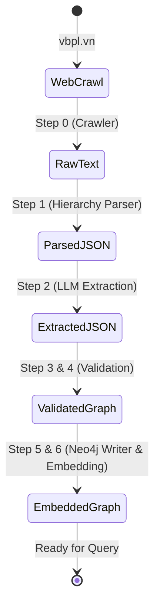

# Graph Construction Pipeline — Chi Tiết Kỹ Thuật

> **Phiên bản**: 0.4
> **Liên quan đến**: RC2
> **Depends on**: [legal_ontology.md v1.5.1](./legal_ontology.md)

> [!WARNING]
> Relation names đã đổi sang **active voice** theo ADR-17. Sử dụng các tên mới trong mọi implementation mới:
> `AMENDED_BY` → `AMENDS` | `REPLACED_BY` → `REPLACES` | `REPEALED_BY` → `REPEALS` | `IMPLEMENTED_BY` → `GUIDES`
> EntityType mới: `Action` (động từ pháp lý) — bên cạnh `Entity` và `Concept`.

---

## Tổng Quan Flow

```
[Web] CSDL Pháp luật / Thư viện pháp luật
      │ (Step 0: Crawler crawl web text + Metadata)
      ▼
[Raw text + Metadata] Văn bản pháp luật thô
      │ (Step 1: Hierarchy Parser)
      ▼
[JSON] Cấu trúc phân cấp (Phần → Chương → Mục → Điều → Khoản → Điểm)
       + Metadata (ngày hiệu lực, tình trạng) đính kèm sẵn vào Document node
      │
      ├─ (Step 2.1: Semantic Chunking) ───────► Embedding Index (Neo4j Vector)
      │
      │ (Step 2.2: LLM Entity Extraction)
      ▼  Input : Text chunks (Article/Clause level)
    │   Output: Entities + Relations (JSON)
    │
    ▼
[Step 3] JSON Schema Validation
    │   Input : LLM JSON output
    │   Output: Validated JSON | ValidationError
    │
    ▼
[Step 3.5] Relation Normalizer / Enricher
    │   Input : Validated JSON + document/article context + LLM config
    │   Output: Relations with ontology-required properties
    │
    ▼
[Step 3.6] Label Normalization
    │   Input : Extraction labels (Entity, Concept, Action)
    │   Output: Canonical ontology labels (LegalSubject, LegalConcept, LegalAction)
    │
    ▼
[Step 4] Ontology Validation
    │   Input : Enriched relations
    │   Output: Ontology-compliant triples | OntologyError
    │
    ▼
[Step 5] Confidence Scoring                       ← ADR-06: rule-based, không phải N=3
    │   Input : Enriched, ontology-valid relations + graph context
    │   Output: confidence score ∈ [0, 1] (weighted multi-criteria)
    │
    ▼
[Decision Gate]
    ├── confidence ≥ T_auto → Auto-accept → Neo4j Writer
    ├── T_review ≤ confidence < T_auto → Human Review Queue
    └── confidence < T_review → Rejection Log
```

---

## Document Lifecycle

Vòng đời của một văn bản pháp luật đi qua các trạng thái (state) trong hệ thống:



---

## Data Models & Contracts

Để đảm bảo hệ thống không bị "gãy" ở các bước nối tiếp, mỗi bước đều có một Output Schema chuẩn và một bản cam kết (Data Contract).

### 1. Crawler Output & Contract
**Schema:** `data/raw/<raw_doc_code>/metadata.json` và `data/raw/<raw_doc_code>/source.txt`.
```json
{
  "raw_doc_code": "LDN2020",
  "graph_id": "ldn_2020",
  "title": "Luật Doanh nghiệp 2020",
  "number": "59/2020/QH14",
  "type": "Law",
  "issuer_name": "Quốc hội",
  "issuer_branch": "LEGISLATIVE",
  "normative": true,
  "issued_date": "2020-06-17",
  "effective_from": "2021-01-01",
  "effective_to": null,
  "status": "active",
  "source_url": "https://vbpl.vn/..."
}
```
> **Contract**: `raw_doc_code`, `graph_id`, `title`, `source_url` KHÔNG BAO GIỜ null. `raw_doc_code` là mã crawl/thư mục gốc; `graph_id` là ID canonical dùng cho parser, validator, writer, citation và Neo4j `MERGE`. `type` là raw crawler field; parser/writer phải map sang ontology field `doc_type`. `status` là raw crawler field; parser/writer phải map sang ontology field `legal_status` (`ACTIVE`, `REPEALED`, etc.) trước mọi graph output. `normative` phải được derive từ `doc_type` hoặc metadata nguồn; với corpus hiện tại mặc định `true` cho văn bản quy phạm pháp luật. `source.txt` chứa raw text riêng, không nằm trong `metadata.json`. Crawler chịu trách nhiệm lưu cả hai theo cùng `raw_doc_code`, đồng thời map `issuer_name` thành ID theo `ISSUER_BRANCH_MAP`.

### 2. Parser Output & Contract
**Schema:** Cây JSON phân cấp cấu trúc văn bản.
```json
{
  "document": {
    "id": "ldn_2020",
    "doc_type": "Law",
    "normative": true,
    "issuer_name": "Quốc hội",
    "legal_status": "ACTIVE"
  },
  "articles": [
    {
      "number": "17",
      "content_raw": "...",
      "clauses": [
         { "number": "1", "content_raw": "..." }
      ]
    }
  ]
}
```
> **Contract**: Khôi phục đúng cấu trúc cha-con. Thuộc tính `number` của Article và Clause luôn được extract thành công, định dạng số nguyên/chuỗi chuẩn. Parser phải normalize `raw_doc_code`/metadata thành `document.id = graph_id`, `type` thành `doc_type`, `status` thành `legal_status`, và bảo đảm `normative` tồn tại trước mọi bước downstream. Không sinh ra UUID ngẫu nhiên mà dùng deterministic ID (`ldn_2020_art17_cl1`).

### 3. Extractor Output & Contract
**Schema:** JSON danh sách entities và relations.
```json
{
  "entities": [
    {"type": "Concept", "name": "Vốn điều lệ"}
  ],
  "relations": [
    {"head": "...", "relation": "DEFINES", "tail": "Vốn điều lệ"}
  ]
}
```
> **Contract**: LLM chỉ được phép trả về JSON. Các key `entities` và `relations` luôn tồn tại (dù có thể rỗng rỗng). `type` của entity phải nằm trong danh sách Enum (Entity, Concept, Action).

### 4. Validator & Writer Contract
> **Validator Guarantee**: Bất cứ triple nào lọt qua được Validator đều tuân thủ 100% rules trong `legal_ontology.md` v1.5.0. Nếu có lỗi, relation bị drop hoặc raise error.
> **Writer Guarantee (Neo4j)**: Quá trình MERGE mang tính Idempotent. Việc chạy lại cùng một file JSON 10 lần sẽ không sinh ra duplicate node hay edge nào trong đồ thị.

### 5. Embedding Contract

Theo ADR-20, embedding contract hiện hành là:

```text
Primary model: BAAI/bge-m3
Provider: FlagEmbedding
EMBEDDING_DIM: 1024
normalize_embeddings: true
```

BKAI Vietnamese bi-encoder 768-dim chỉ là baseline/ablation. Article và Clause
được embed; Point và semantic nodes không được embed trong Phase 1.

Rules:

- model output dimension phải bằng `EMBEDDING_DIM`
- `article_embedding` và `clause_embedding` phải dùng cùng concrete dimension
- dimension mismatch là hard failure trước database update
- đổi dimension bắt buộc recreate vector indexes và re-embed toàn bộ Article/Clause
- application config, ontology contract và Neo4j schema phải được test parity

### 6. CLI Identity Contract

Mọi CLI command dùng filesystem folder phải nhận `--raw-doc-code`. `graph_id` là
canonical Neo4j ID lấy từ metadata, không phải CLI folder argument.

```text
raw_doc_code = L59_2020   -> data/raw/L59_2020, data/processed/L59_2020
graph_id = ldn_2020       -> (:Document {id: "ldn_2020"})
```

Target command surface:

```bash
python -m src.pipeline.main crawl --raw-doc-code L59_2020 ...
python -m src.pipeline.main parse --raw-doc-code L59_2020
python -m src.pipeline.main extract --raw-doc-code L59_2020
python -m src.pipeline.main write --raw-doc-code L59_2020
python -m src.pipeline.main embed --raw-doc-code L59_2020
python -m src.pipeline.main graph-quality --raw-doc-code L59_2020
```

`--doc-id` is superseded for folder-scoped pipeline commands and must not remain as
a hidden compatibility branch after implementation and docs migrate.

---

## Chi Tiết Các Bước

### Step 0: Crawler & Metadata Ingestion

Thay vì bắt LLM tự đoán các trường thông tin quan trọng như `effective_from`, `effective_to` từ nội dung text (rất dễ sai sót do hallucination hoặc do văn bản ghi lằng nhằng), chúng ta crawl trực tiếp metadata "sự thật tuyệt đối" từ trang web cùng lúc lấy raw text.

**Input**: URL văn bản pháp luật (tab `?tabs=thuoc-tinh` trên vbpl.vn)
**Output**: 
1. `source.txt` chứa raw text văn bản (lưu vào `data/raw/<raw_doc_code>/`)
2. `metadata.json` chứa thông tin cứng (cào từ tab **Thuộc tính** vbpl.vn — controlled vocabulary, không để LLM đoán):

```json
{
  "raw_doc_code":  "LDN2020",
  "graph_id":      "ldn_2020",
  "title":         "Luật Doanh nghiệp số 59/2020/QH14",
  "number":        "59/2020/QH14",
  "type":          "Law",
  "issuer_name":   "Quốc hội",
  "issuer_branch": "LEGISLATIVE",
  "normative":     true,
  "issued_date":   "2020-06-17",
  "effective_from": "2021-01-01",
  "effective_to":  null,
  "status":        "active",
  "source_url":    "https://vbpl.vn/van-ban/chi-tiet/luat-doanh-nghiep-so-59-2020-qh14--142847"
}
```

> `issuer_name` cào từ field **"Cơ quan ban hành"** tab Thuộc tính — đã normalize theo controlled vocabulary vbpl.vn.  
> `issuer_branch` map qua `ISSUER_BRANCH_MAP` trong `vbpl_crawler.py`; default `OTHER`.  
> `graph_id` là ID duy nhất writer được dùng trong Neo4j. Nếu crawler chỉ có `raw_doc_code`, parser/writer phải normalize sang canonical ID trước `MERGE`.
> `type` là raw metadata từ website/crawler, không phải ontology property. Writer phải chuyển thành `doc_type`.
> `status` là raw metadata từ website, không phải ontology property. Writer phải chuyển thành `legal_status` theo enum trong `legal_ontology.md`.
> `normative` mặc định `true` cho corpus văn bản quy phạm pháp luật hiện tại, trừ khi metadata nguồn chứng minh ngược lại.
> Writer dùng `issuer_name` để `MERGE (:Issuer {id: slug(issuer_name)})` per **ADR-14 Rev.1**.


### Step 1: Hierarchy Parser (Raw text → JSON)

**Mục tiêu**: Chuyển đổi `source.txt` thành cấu trúc phân cấp, đồng thời đính kèm (inject) web metadata vào node Document gốc.

```
Document
├── Phần (Part)          [optional]
│   └── Chương (Chapter)
│       └── Mục (Section) [optional]
│           └── Điều (Article)
│               └── Khoản (Clause)
│                   └── Điểm (Point)
│                       └── [text content]
```

### Pattern Nhận Dạng

```python
PATTERNS = {
    "article": r"^Điều\s+(\d+)\.\s*(.+)",
    # "Điều 17. Điều kiện thành lập..."
    
    "clause": r"^(\d+)\.\s+",
    # "1. Doanh nghiệp được thành lập..."
    
    "point": r"^([a-zđ])\)\s+",
    # "a) Có vốn điều lệ..."
    
    "chapter": r"^Chương\s+([IVXLCDM]+)\s*$",
    # "Chương II"
    
    "chapter_title": r"^([A-ZĐÀÁẠẢÃÂẦẤẬẨẪĂẰẮẶẲẴÈÉẸẺẼÊỀẾỆỂỄÌÍỊỈĨÒÓỌỎÕÔỒỐỘỔỖƠỜỚỢỞỠÙÚỤỦŨƯỪỨỰỬỮỲÝỴỶỸ ]+)$"
    # Dòng toàn chữ hoa = tiêu đề chương
}
```

### Output Format

```json
{
  "document": {
    "id": "ldn_2020",
    "title": "Luật Doanh nghiệp",
    "number": "59/2020/QH14",
    "doc_type": "Law",
    "normative": true,
    "issuer_name": "Quốc hội",
    "issued_date": "2020-06-17",
    "effective_from": "2021-01-01",
    "legal_status": "ACTIVE"
  },
  "articles": [
    {
      "number": 17,
      "title": "Điều kiện thành lập, quản lý doanh nghiệp",
      "content_raw": "1. Tổ chức, cá nhân sau đây...",
      "clauses": [
        {
          "number": 1,
          "content": "Tổ chức, cá nhân sau đây có quyền...",
          "points": [
            {
              "label": "a",
              "content": "Cơ quan nhà nước, đơn vị vũ trang nhân dân..."
            }
          ]
        }
      ]
    }
  ]
}
```

---

## Step 2: LLM Information Extraction

Structural identity is parser-owned. The relation prompt receives canonical
Article/Clause/Point IDs from `hierarchy.json`; the LLM must not emit `CONTAINS`
or invent structural IDs. Every proposed endpoint is normalized before ontology
validation. Raw LLM endpoint IDs are audit data only and can never enter an
accepted record or graph payload.

> [!NOTE]
> **Phase 1 scope**: LLM extraction hiện tại chỉ cover 3 semantic type (`Entity/Concept/Action` → `LegalSubject/LegalConcept/LegalAction`). `Obligation/Right/Condition/Exception` thuộc Future work — xem `legal_ontology.md` §2.2 để biết rationale và điều kiện triển khai.
> Phase 1 validator chỉ cho phép `REQUIRES: LegalSubject -> LegalConcept` (`Entity -> Concept` trong extraction schema). `LegalSubject -> Obligation` thuộc runtime/future phase, không persist trong graph construction M1-M3.

### Two-Pass Strategy

**Pass 1 — Entity Extraction** (per Article):

```python
ENTITY_EXTRACTION_PROMPT = """
Cho điều luật sau:
---
{article_text}
---

Trích xuất tất cả entities được đề cập:

1. Documents được viện dẫn (số hiệu văn bản)
2. Concepts pháp lý (khái niệm, thuật ngữ chuyên ngành)
3. Entities (loại hình doanh nghiệp, cơ quan, chủ thể)

Trả về JSON:
{
  "entities": [
    {
      "id": "string (unique, snake_case)",
      "type": "Document|Concept|Entity|Article",
      "label": "string (tên hiển thị)",
      "properties": {}
    }
  ]
}
"""

**Pass 2 — Relation Extraction** (per Article, using entities from Pass 1):

```python
RELATION_EXTRACTION_PROMPT = """
Cho điều luật sau và danh sách entities đã xác định:
---
Article: {article_text}
Entities: {entities_json}
---

Xác định các quan hệ giữa entities.
Chỉ sử dụng các relation types sau:
- AMENDS: Văn bản/đơn vị mới hơn sửa đổi văn bản/đơn vị cũ hơn
- REPLACES: Văn bản mới hơn thay thế hoàn toàn văn bản cũ hơn
- REPEALS: Văn bản mới hơn bãi bỏ văn bản/đơn vị cũ hơn
- REFERS_TO: A viện dẫn B
- DEFINES: Article/Clause định nghĩa Concept
- REGULATES: Article/Clause điều chỉnh Entity/Action
- REQUIRES: Entity yêu cầu/phải có Concept
- GUIDES: Văn bản cấp cao hướng dẫn cấp thấp (Law→Decree, Decree→Circular...)

Trả về JSON:
{
  "relations": [
    {
      "head": "entity_id",
      "relation": "RELATION_TYPE",
      "tail": "entity_id",
      "evidence": "câu văn làm cơ sở",
      "confidence": 0.0-1.0
    }
  ]
}
"""
```

---

## Step 3: JSON Schema Validation

```python
ENTITY_SCHEMA = {
    "type": "object",
    "required": ["id", "type", "label"],
    "properties": {
        "id": {"type": "string", "pattern": "^[a-z0-9_]+$"},
        "type": {"enum": [
            "Document", "Chapter", "Article", "Clause", "Point",
            "Concept", "Entity",
            "Action"   # v1.1.0: hành vi pháp lý (thành lập, góp vốn, giải thể...)
        ]},
        "label": {"type": "string", "minLength": 1},
        "properties": {"type": "object"}
    }
}

# NOTE: "Definition" đã được loại bỏ khỏi enum.
# Definition = attribute của Concept (Concept.definition), không phải node riêng.
# Quyết định: ADR session 2026-06-29.

RELATION_SCHEMA = {
    "type": "object",
    "required": ["head", "relation", "tail"],
    "properties": {
        "head": {"type": "string"},
        "relation": {"enum": [
            "CONTAINS",
            "AMENDS",      # v1.1.0: active voice (cũ: AMENDED_BY)
            "REPLACES",    # v1.1.0: active voice (cũ: REPLACED_BY)
            "REPEALS",     # v1.1.0: active voice (cũ: REPEALED_BY)
            "GUIDES",      # v1.1.0: active voice (cũ: IMPLEMENTED_BY)
            "REFERS_TO",   # v1.1.0: (cũ: REFERENCES)
            "DEFINES", "REGULATES", "REQUIRES"
            # Tổng: 9 relation types
        ]},
        "tail": {"type": "string"},
        "evidence": {"type": "string"},
        "confidence": {"type": "number", "minimum": 0, "maximum": 1}
    }
}
```

---

## Step 3.5: Relation Normalizer / Enricher

LLM output intentionally stays small: `head`, `relation`, `tail`, `evidence`, `confidence`. Before label normalization, ontology validation, and any writer handoff, the pipeline must enrich relation properties required by `legal_ontology.md`.

**Required normalization rules:**

| Relation | Input | Output properties |
|---|---|---|
| `REFERS_TO` | `evidence`, raw confidence, parser citation context, Article checkpoint | `confidence`, checkpoint-derived `llm_model` and `created_at`, `citation_text`, `citation_type` |
| `DEFINES` | raw confidence, Article checkpoint | `confidence`, checkpoint-derived `llm_model`, `created_at` |
| `REGULATES` | raw confidence, Article checkpoint | `confidence`, checkpoint-derived `llm_model`, `created_at` |
| `REQUIRES` | raw confidence, Article checkpoint, article context | `confidence`, checkpoint-derived `llm_model`, `created_at`, `source_article` |
| `AMENDS`, `REPEALS`, `REPLACES` | document metadata | `effective_from`; `source_doc_id` when relation is emitted from the current document |

```python
def enrich_relation(raw_relation, *, document, article, llm_model, created_at):
    props = {}
    if raw_relation.relation in {"AMENDS", "REPEALS", "REPLACES"}:
        props["effective_from"] = document.effective_from
    if raw_relation.relation == "REFERS_TO":
        props["citation_text"] = raw_relation.evidence
        props["citation_type"] = "DIRECT"
    if raw_relation.relation in {"DEFINES", "REGULATES", "REQUIRES", "REFERS_TO"}:
        props["confidence"] = raw_relation.confidence
        props["llm_model"] = llm_model
        props["created_at"] = created_at
    if raw_relation.relation == "REQUIRES":
        props["source_article"] = f"{document.id}_art{article.number}"
    return props
```

> **Rule**: Ontology validation receives enriched properties, not raw LLM output. The writer must never fill these required ontology properties silently after validation.
> `llm_model` and `created_at` come from the immutable Article checkpoint, not the current environment or normalization time.

---

## Step 3.6: Label Normalization

Pydantic extraction labels are not Neo4j ontology labels. They exist only at the LLM boundary because the extraction task is intentionally simple.

**Mandatory mapping before ontology validation:**

| Extraction label | Canonical ontology label |
|---|---|
| `Entity` | `LegalSubject` |
| `Concept` | `LegalConcept` |
| `Action` | `LegalAction` |
| `Document`, `Chapter`, `Article`, `Clause`, `Point` | unchanged |

```python
ONTOLOGY_LABEL_MAP = {
    "Entity": "LegalSubject",
    "Concept": "LegalConcept",
    "Action": "LegalAction",
}
```

> **Rule**: `Entity`, `Concept`, and `Action` must not appear in Step 4 ontology constraints or Neo4j writes. If they appear after Step 3.6, it is a normalization bug.

---

## Step 4: Ontology Validation

> [!IMPORTANT]
> Source of truth: `legal_ontology.md` v1.5.0.
> ADR-15: `GUIDES_WHITELIST` chỉ trong validator, không trong Neo4j. Numeric precedence/level rules are legacy and must not be used in the current validator.
> ADR-17: Tất cả relation names dùng active voice.

```python
# GUIDES whitelist — trích từ legal_ontology.md §5
GUIDES_WHITELIST = {
    ("Constitution", "Law"), ("Constitution", "Ordinance"),
    ("Law", "Decree"), ("Law", "Decision"), ("Law", "Circular"),
    ("Ordinance", "Decree"), ("Resolution", "Decree"),
    ("Decree", "Circular"), ("Decree", "Decision"), ("Decree", "JointCircular"),
    ("Decision", "Circular"),
}

RELATION_ENUM = {
    "CONTAINS", "AMENDS", "REPLACES", "REPEALS",
    "GUIDES",
    "REFERS_TO", "DEFINES", "REGULATES", "REQUIRES"
    # Tổng: 9 — active voice theo ADR-17
}

CONSTRAINTS = {
    "CONTAINS": {
        "valid_pairs": [
            ("Document", "Chapter"),
            ("Chapter",  "Article"),
            ("Document", "Article"),
            ("Article",  "Clause"),
            ("Clause",   "Point")
        ],
        "no_self_loop": True
    },
    "AMENDS": {
        # Active direction: newer -> older affected unit.
        "valid_pairs": [
            ("Document", "Document"),
            ("Document", "Article"),
            ("Document", "Clause"),
            ("Article",  "Document"),
            ("Article",  "Article"),   # Điều→Điều
            ("Article",  "Clause"),    # Điều→Khoản ← phổ biến nhất VN
            ("Clause",   "Document"),
            ("Clause",   "Clause"),    # Khoản→Khoản
            ("Clause",   "Article"),   # Khoản→Điều (mở rộng)
        ],
        "no_self_loop": True,
        "required_properties": ["effective_from"]
    },
    "REPLACES": {
        "valid_pairs": [
            ("Document", "Document"),
        ],
        "no_self_loop": True,
        "required_properties": ["effective_from"]
    },
    "REPEALS": {
        "valid_pairs": [
            ("Document", "Document"),
            ("Document", "Article"),
            ("Document", "Clause"),
        ],
        "required_properties": ["effective_from"]
    },
    "GUIDES": {
        # Whitelist-based rule (thay level comparison cũ).
        # Xem GUIDES_WHITELIST ở trên — trích từ legal_ontology.md §5.
        "rule": "guides_whitelist",
    },
    "REFERS_TO": {
        "valid_pairs": [
            ("Article", "Article"),
            ("Article", "Clause"),
            ("Article", "Point"),
            ("Article", "Document"),
            ("Clause",  "Article"),
            ("Clause",  "Clause"),
            ("Clause",  "Point"),
            ("Clause",  "Document"),
            ("Point",   "Article"),
            ("Point",   "Clause"),
            ("Point",   "Point"),
            ("Point",   "Document"),
        ],
        "required_properties": ["confidence", "llm_model", "created_at", "citation_text", "citation_type"]
    },
    "DEFINES": {
        "valid_pairs": [
            ("Article", "LegalConcept"),
            ("Clause",  "LegalConcept")
        ],
        "required_properties": ["confidence", "llm_model", "created_at"]
    },
    "REGULATES": {
        "valid_pairs": [
            ("Article", "LegalSubject"),
            ("Article", "LegalAction"),
            ("Clause",  "LegalSubject"),
            ("Clause",  "LegalAction"),
        ],
        "required_properties": ["confidence", "llm_model", "created_at"]
    },
    "REQUIRES": {
        "valid_pairs": [("LegalSubject", "LegalConcept")],
        "required_properties": ["confidence", "llm_model", "created_at"]
    }
}
```

---

## Unit Test Spec — Ontology Consistency

> Xem implementation thực tế: `tests/test_ontology_consistency.py` (14 test cases, 42 passed tổng).

```python
# tests/test_ontology_consistency.py
# Chạy: pytest tests/test_ontology_consistency.py
# Tốc độ: <1ms, không cần DB hay LLM
# ADR-17: Tất cả relation names dùng active voice

from src.shared.ontology.validators import (
    CONSTRAINTS, RELATION_ENUM, validate_relation,
)

def test_all_relations_have_constraints():
    missing = RELATION_ENUM - set(CONSTRAINTS.keys())
    assert missing == set(), f"Relations thiếu constraint: {missing}"

def test_no_orphan_constraints():
    orphans = set(CONSTRAINTS.keys()) - RELATION_ENUM
    assert orphans == set(), f"Constraints thừa: {orphans}"

def test_refers_to_not_rejected():
    ok, err = validate_relation(
        "Article",
        "REFERS_TO",
        "Article",
        properties={
            "confidence": 0.8,
            "llm_model": "gemini:gemini-3.1-flash-lite",
            "created_at": "2026-07-12T00:00:00Z",
            "citation_text": "theo Điều 17",
            "citation_type": "DIRECT",
        },
    )
    assert ok, f"REFERS_TO bị reject: {err}"

def test_requires_canonical_labels_only():
    props = {"confidence": 0.8, "llm_model": "gemini:gemini-flash-lite-latest", "created_at": "2026-07-09T00:00:00+00:00"}
    ok, err = validate_relation("LegalSubject", "REQUIRES", "LegalConcept", properties=props)
    assert ok, f"REQUIRES bị reject: {err}"
    ok, _ = validate_relation("Entity", "REQUIRES", "Concept", properties=props)
    assert not ok

def test_replaces_document_only():
    ok, _ = validate_relation("Article", "REPLACES", "Document", properties={"effective_from": "2021-01-01"})
    assert not ok
    ok, _ = validate_relation("Document", "REPLACES", "Document", properties={"effective_from": "2021-01-01"})
    assert ok

def test_guides_whitelist_valid():
    ok, err = validate_relation("Document", "GUIDES", "Document", head_doc_type="Law", tail_doc_type="Decree")
    assert ok, f"Law→Decree bị reject: {err}"

def test_guides_same_level_rejected():
    ok, _ = validate_relation("Document", "GUIDES", "Document", head_doc_type="Law", tail_doc_type="Law")
    assert not ok, "Law→Law không hợp lệ"

def test_unknown_relation_rejected():
    # Old names (AMENDED_BY, GUIDED_BY) phải bị reject sau khi rename ADR-17
    ok, _ = validate_relation("Article", "GUIDED_BY", "Document")
    assert not ok
    ok, _ = validate_relation("Article", "AMENDED_BY", "Document")
    assert not ok
```

---

## Step 5: Confidence Scoring (Rule-based)

> [!IMPORTANT]
> **ADR-06**: Dùng rule-based multi-criteria, KHÔNG dùng self-consistency N=3.
> Lý do: Explainable, không tốn thêm API calls, threshold calibrate được trên validation set.

```python
class ConfidenceScorer:
    """Rule-based confidence scorer theo ADR-06."""

    WEIGHTS = {
        "schema_valid":       0.30,
        "ontology_valid":     0.30,
        "evidence_present":   0.20,
        "entities_resolvable":0.10,
        "direction_correct":  0.10,
    }

    def score(self, extraction: dict, validation_results: dict, graph_context: dict) -> tuple[float, dict]:
        """
        Args:
            extraction: LLM extraction result
            validation_results: kết quả từ JSON Schema + Ontology Validator
            graph_context: các IDs hiện có trong graph (dùng kiểm tra entity resolvable)
        Returns:
            (confidence_score, criteria_breakdown)
        """
        criteria = {
            # 1. JSON Schema pass?
            "schema_valid": 1.0 if validation_results.get("schema_ok") else 0.0,

            # 2. Ontology constraint pass?
            "ontology_valid": 1.0 if validation_results.get("ontology_ok") else 0.0,

            # 3. Có evidence trong text?
            "evidence_present": 1.0 if extraction.get("evidence", "").strip() else 0.0,

            # 4. Head + Tail IDs resolvable?
            "entities_resolvable": self._check_entities(
                extraction, graph_context
            ),

            # 5. Hướng relation đúng?
            "direction_correct": 1.0 if validation_results.get("direction_ok") else 0.0,
        }

        score = sum(
            self.WEIGHTS[k] * v for k, v in criteria.items()
        )
        return round(score, 3), criteria

    def _check_entities(self, extraction, graph_context) -> float:
        head_id = extraction.get("head", "")
        tail_id = extraction.get("tail", "")
        existing_ids = graph_context.get("existing_ids", set())
        resolved = sum([
            1 if head_id in existing_ids else 0,
            1 if tail_id in existing_ids else 0
        ])
        return resolved / 2.0
```

### Threshold Calibration (thực hiện sau khi có validation data)

**Phương pháp Calibration (để chọn $T_{auto}$ và $T_{review}$)**:

1. Annotate thủ công 3 văn bản để tạo tập Gold Standard Triples.
2. Chạy extraction pipeline, tính confidence score cho mọi triple được tạo ra.
3. Vẽ đồ thị Precision-Recall (PR curve) dọc theo các mức threshold khác nhau.
4. Chọn threshold tối ưu (ví dụ: tối đa hóa F1-score hoặc ưu tiên Precision để đảm bảo độ tin cậy của Graph).
5. Báo cáo các threshold cụ thể và PR curve trong chương Đánh giá của luận văn.

> **Lưu ý**: Tuyệt đối không hardcode các số như `0.7` hay `0.3` vào kiến trúc trước khi thực nghiệm (empirical calibration).

---

## Human Review Queue

```python
class HumanReviewQueue:
    """
    Đơn giản nhất: lưu vào file JSON, reviewer mở và check
    Có thể upgrade lên web UI sau
    """
    
    def push(self, item: dict, confidence: float, reason: str):
        entry = {
            "id": uuid4().hex,
            "timestamp": datetime.now().isoformat(),
            "confidence": confidence,
            "reason": reason,
            "extraction": item,
            "status": "pending",  # pending | approved | rejected | modified
            "reviewer_comment": None
        }
        # Append to JSONL file
        with open("human_review_queue.jsonl", "a") as f:
            f.write(json.dumps(entry, ensure_ascii=False) + "\n")
```

---

## Evaluation — Level 1 (Graph Construction Quality)

```python
def evaluate_graph_construction(gold_graph: dict, predicted_graph: dict):
    """
    So sánh predicted graph với gold standard annotation
    """
    # Entity metrics
    gold_entities = set(e["id"] for e in gold_graph["entities"])
    pred_entities = set(e["id"] for e in predicted_graph["entities"])
    
    entity_tp = len(gold_entities & pred_entities)
    entity_precision = entity_tp / len(pred_entities) if pred_entities else 0
    entity_recall = entity_tp / len(gold_entities) if gold_entities else 0
    
    # Relation metrics (head, relation, tail) tuple matching
    gold_rels = set(
        (r["head"], r["relation"], r["tail"]) 
        for r in gold_graph["relations"]
    )
    pred_rels = set(
        (r["head"], r["relation"], r["tail"]) 
        for r in predicted_graph["relations"]
    )
    
    rel_tp = len(gold_rels & pred_rels)
    rel_precision = rel_tp / len(pred_rels) if pred_rels else 0
    rel_recall = rel_tp / len(gold_rels) if gold_rels else 0
    
    return {
        "entity_precision": entity_precision,
        "entity_recall": entity_recall,
        "entity_f1": 2 * entity_precision * entity_recall / (entity_precision + entity_recall + 1e-9),
        "relation_precision": rel_precision,
        "relation_recall": rel_recall,
        "relation_f1": 2 * rel_precision * rel_recall / (rel_precision + rel_recall + 1e-9)
    }
```
