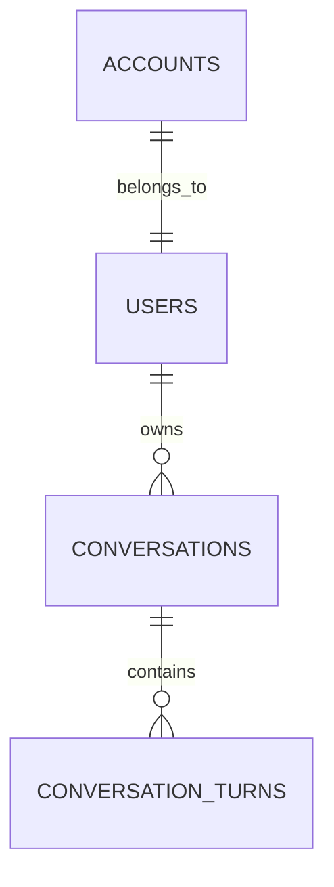

# Plan 20 — User Authentication & Conversation History Management

Status: PROPOSED
Dependencies: `Plan 19 (19_conversation_context.md)`
Author: Antigravity AI Team
Created At: 2026-08-05

Bản kế hoạch này mở rộng kiến trúc **Plan 19** từ mô hình chỉ dùng Anonymous Principal sang hệ thống hỗ trợ **Đăng ký / Đăng nhập (User Authentication)** dựa trên **Username/Password đơn giản** (loại bỏ bảng `user_sessions`), tách biệt **Thông tin Đăng nhập (Account)** và **Hồ sơ Người dùng (User)**, cùng với **Lưu trữ / Tra cứu Lịch sử Hội thoại (Chat History Persistence)**.

---

## 1. Mục tiêu và Invariants

### Luồng tổng quát:
```text
Guest/Anonymous Browser
    ├── (Chưa đăng nhập) → Dùng Signed Anonymous Cookie (Plan 19)
    └── (Đăng nhập / Đăng ký)
          ↓
  Authenticate via Account (Username & Password)
          ↓
  Issue Signed JWT Access Cookie (hoặc Bearer Header)
          ↓
  Resolve Principal: owner_kind = 'USER', owner_principal_id = user_id
          ↓
  Optionally Claim Guest Conversations (chuyển hội thoại ẩn danh về user_id)
          ↓
  Full Access to User Chat History (List, Retrieve, Rename, Delete Conversations)
```

### Invariants:
1. **Đăng nhập bằng Username**: Đăng ký và đăng nhập sử dụng duy nhất `username` và `password` (không sử dụng email).
2. **Kiến trúc Tinh gọn (Không dùng `user_sessions`)**: Không lưu trữ phiên/token revocation trong database. Việc xác thực JWT thực hiện trực tiếp qua mã hóa HMAC signature / Secret Key.
3. **Tách biệt User và Account**:
   - Bảng `accounts`: Lưu trữ thông tin tài khoản đăng nhập (`username`, `password_hash`, liên kết 1-1 với `user_id`).
   - Bảng `users`: Lưu trữ thông tin profile đại diện cho người dùng (`full_name`, `avatar_url`, `is_active`).
4. **Tương thích ngược với Plan 19**: Không phá vỡ luồng `idempotency`, `advisory locking`, `context resolution`, `grounding` và `buffered SSE` đã triển khai ở Plan 19.
5. **PostgreSQL là Source of Truth**: Bảng `users`, `accounts`, và `conversations` xác định quyền sở hữu hội thoại (ownership isolation).
6. **Owner Isolation**: Người dùng A tuyệt đối không thể xem, sửa hoặc xóa hội thoại của người dùng B (trả về `404 CONVERSATION_NOT_FOUND`).
7. **No Hardcoded Credentials**: Tham số `JWT_SECRET_KEY`, TTL,... được cấu hình qua môi trường (`.env`). Thất bại ném `ConfigurationException` nếu thiếu secret.
8. **Clean Code & Backend Rules**: Mọi service / usecase tuân thủ quy tắc đánh số comment (e.g. `// 1.   `, `// 2.   `).

---

## 2. Mô hình Dữ liệu (Database Schema Extension)

Bổ sung **2 bảng mới** (`users`, `accounts`) và cập nhật bảng `conversations` từ Plan 19.



### 2.1. Bảng `users`
Lưu trữ thông tin hồ sơ người dùng (Profile).

```sql
CREATE TABLE users (
    id UUID PRIMARY KEY DEFAULT gen_random_uuid(),
    full_name VARCHAR(128),
    avatar_url TEXT,
    is_active BOOLEAN NOT NULL DEFAULT TRUE,
    created_at TIMESTAMPTZ NOT NULL DEFAULT NOW(),
    updated_at TIMESTAMPTZ NOT NULL DEFAULT NOW()
);
```

### 2.2. Bảng `accounts` (Đơn giản: Username & Password)
Lưu trữ tài khoản đăng nhập chính của người dùng.

```sql
CREATE TABLE accounts (
    id UUID PRIMARY KEY DEFAULT gen_random_uuid(),
    user_id UUID NOT NULL UNIQUE REFERENCES users(id) ON DELETE CASCADE,
    username VARCHAR(64) NOT NULL UNIQUE,
    password_hash VARCHAR(255) NOT NULL,
    created_at TIMESTAMPTZ NOT NULL DEFAULT NOW(),
    updated_at TIMESTAMPTZ NOT NULL DEFAULT NOW()
);

CREATE UNIQUE INDEX ix_accounts_username ON accounts(LOWER(username));
CREATE INDEX ix_accounts_user_id ON accounts(user_id);
```

### 2.3. Cập nhật Bảng `conversations` (từ Plan 19)
Thêm cột `title`, `is_deleted` và mở rộng `OwnerKind` Enum.

```sql
-- Mở rộng OwnerKind enum trong Postgres
ALTER TYPE owner_kind ADD VALUE IF NOT EXISTS 'USER';

-- Thêm các cột quản lý lịch sử giao diện
ALTER TABLE conversations 
    ADD COLUMN title VARCHAR(255) NOT NULL DEFAULT 'Cuộc trò chuyện mới',
    ADD COLUMN is_deleted BOOLEAN NOT NULL DEFAULT FALSE;

-- Index hỗ trợ query lịch sử chat của user nhanh chóng
CREATE INDEX ix_conversations_owner_history 
    ON conversations(owner_kind, owner_principal_id, is_deleted, updated_at DESC);
```

---

## 3. Kiến trúc Auth & Authorization Flow

### 3.1. Principal Resolution Middleware (Cập nhật `auth/principal.py`)

Khi request đến backend:
```text
Client Request (Headers / Cookies)
   │
   ├── 1. Kiểm tra JWT Token trong Cookie (`graphrag_user_token`) hoặc Header `Authorization: Bearer <token>`
   │      └── Signature Hợp lệ & Chưa hết hạn → Owner(owner_kind=OwnerKind.USER, owner_principal_id=user_id)
   │
   └── 2. Nếu không có JWT / User auth
          └── Fallback về Signed Anonymous Principal Cookie (Plan 19)
                 → Owner(owner_kind=OwnerKind.ANONYMOUS, owner_principal_id=anon_uuid)
```

### 3.2. Chuyển đổi Lịch sử Chat (Claim Guest Conversations)
Khi một guest user đăng ký hoặc đăng nhập:
1. Client gửi request `POST /api/v1/auth/claim-guest` chứa `anon_principal_id` (trích xuất từ cookie ẩn danh).
2. Backend kiểm tra quyền và thực hiện query:
   ```sql
   UPDATE conversations
   SET owner_kind = 'USER', owner_principal_id = :current_user_id
   WHERE owner_kind = 'ANONYMOUS' AND owner_principal_id = :anon_principal_id;
   ```
3. Toàn bộ hội thoại ẩn danh được liên kết với `user_id` chính thức.

---

## 4. API Endpoint Specifications

### 4.1. Authentication Routes (`/api/v1/auth`)

| Method | Endpoint | Description | Request Body | Response |
|---|---|---|---|---|
| `POST` | `/api/v1/auth/register` | Đăng ký tài khoản mới (`username`, `password`) | `{ username, password, full_name? }` | User Profile + Auth Cookie |
| `POST` | `/api/v1/auth/login` | Đăng nhập bằng `username` và `password` | `{ username, password }` | User Profile + Auth Cookie |
| `POST` | `/api/v1/auth/logout` | Đăng xuất (Clear Cookie) | - | `{ message: "Success" }` |
| `GET` | `/api/v1/auth/me` | Lấy thông tin User Profile hiện tại | - | User Profile (`username`, `full_name`,...) |
| `POST` | `/api/v1/auth/claim-guest` | Chuyển chat ẩn danh sang user | - | `{ claimed_count: int }` |

### 4.2. Chat History Routes (`/api/v1/conversations`)

| Method | Endpoint | Description | Query / Body | Response |
|---|---|---|---|---|
| `GET` | `/api/v1/conversations` | Lấy danh sách lịch sử hội thoại của User | `?limit=20&offset=0` | `[{ id, title, created_at, updated_at, message_count }]` |
| `GET` | `/api/v1/conversations/{id}` | Lấy chi tiết nội dung cuộc trò chuyện | - | Conversation Details + Full Transcript Messages |
| `PATCH` | `/api/v1/conversations/{id}` | Đổi tên cuộc trò chuyện | `{ title: "Tên mới" }` | Updated Conversation |
| `DELETE` | `/api/v1/conversations/{id}` | Xóa cuộc trò chuyện (Soft Delete) | - | `{ status: "deleted" }` |
| `POST` | `/api/v1/conversations/{id}/generate-title` | Sinh tiêu đề tự động bằng LLM/Rule | - | `{ title: "..." }` |

---

## 5. Tự động sinh Tiêu đề Hội thoại (Title Generation)

Khi cuộc hội thoại hoàn thành turn đầu tiên (`user_turn_no = 1`, `status = COMPLETED`):
1. Service kích hoạt background task rút gọn câu hỏi đầu tiên thành tiêu đề ngắn (tối đa 50 ký tự).
2. Cập nhật `conversations.title`.

---

## 6. Frontend UI Components & Integration

1. **Sidebar Lịch sử Chat (Chat History Sidebar)**:
   - Phân nhóm hội thoại theo thời gian (*Hôm nay*, *7 ngày qua*, *Cũ hơn*).
   - Cho phép Đổi tên, Xóa cuộc trò chuyện, hoặc tạo `+ New Chat`.
2. **Auth Modal / Form**:
   - Form Đăng ký / Đăng nhập đơn giản: **Tên đăng nhập (Username)** & **Mật khẩu (Password)** + Tên hiển thị (Full Name).
   - Tự động gọi API `claim-guest` khi đăng nhập thành công.
3. **User Profile Header**:
   - Hiển thị Username / Full Name, Avatar, Nút Đăng xuất.

---

## 7. Kế hoạch Kiểm thử (Test Matrix)

- **Unit Tests**:
  - Mã hóa & kiểm tra password (`Argon2id` / `bcrypt`).
  - Validate username (chữ, số, gạch dưới, từ 3-32 ký tự).
  - Issue & Parse Signed User JWT.
  - Principal Authenticator: Ưu tiên User Auth -> Fallback Anonymous Auth.
- **Integration Tests**:
  - Register & Login bằng username success / failure.
  - Owner Isolation: User A gọi API lấy conversation của User B -> Trả về `404`.
  - Conversation CRUD: List, Get Transcript, Patch Title, Soft Delete.
  - Claim Guest Conversations: Đảm bảo chuyển đổi đúng `owner_principal_id` trong DB.
  - Alembic Migration: Migration mượt mà không làm mất dữ liệu hiện có ở Plan 19.

---

## 8. Các bước Triển khai (Execution Steps)

1. **Alembic Migration**:
   - Tạo migration `add_simple_users_accounts_tables.py`: tạo 2 bảng `users`, `accounts` (`username`, `password_hash`), mở rộng `owner_kind` enum, bổ sung `title` và `is_deleted` vào `conversations`.
2. **Backend Auth & Domain Models (`apps/backend/auth/` & `persistence/`)**:
   - Implement `User` domain & `Account` domain.
   - Implement `password.py` (hash/verify).
   - Implement JWT/Cookie helper.
   - Cập nhật `principal.py` để hỗ trợ User Auth và Anonymous Cookie.
3. **Backend Persistence Layer**:
   - Implement `UserRepository` & `AccountRepository`.
   - Cập nhật `ConversationRepository` hỗ trợ list, pagination, patch title, soft delete, claim guest conversations.
4. **Backend Routes (`apps/backend/api/routes/`)**:
   - Thêm `routes/auth.py` (`/register`, `/login`, `/logout`, `/me`, `/claim-guest`).
   - Cập nhật & bổ sung `routes/conversations.py`.
5. **Frontend History & Auth UI**:
   - Component Sidebar Lịch sử Chat + Auth Form Đăng nhập/Đăng ký Username/Password.
