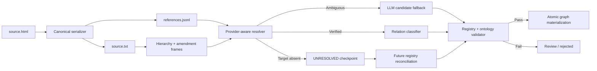

# HTML Reference and Amendment-Context Resolution Plan

> **Status:** In progress — deterministic provider-evidence slice implemented  
> **Date:** 2026-08-12  
> **Scope:** LuatVietnam reference markers, amendment-aware parsing, structural endpoint resolution, and graph relation materialization  
> **Authority:** `plans/legal_ontology.md` remains the source of truth. This plan does not change the frozen ontology by itself.

## 1. Problem Statement

The LuatVietnam crawler serializes every HTML reference span into square brackets in `source.txt`:

```text
<span class="noi-dung-tham-chieu" data-href="...">điểm a khoản 2</span>
```

becomes:

```text
[điểm a khoản 2]
```

The brackets preserve the visible citation text but discard the strongest resolution evidence carried by HTML:

- provider document ID (`docId`);
- provider structural item IDs (`docItemId`, `docItemIds`);
- provider link direction/category (`docItemReferId`, `docItemRelateId`);
- the exact position of the reference while canonical text is being serialized.

This causes three distinct failures:

1. Short references such as `[điểm a khoản 2]` cannot be resolved without inheriting an Article and Document from the amendment context.
2. The word `này` is ambiguous in amending documents. It may refer to the host document or to the amended document whose replacement text is being quoted.
3. Structural headings inside quoted replacement text, such as `“Điều 17a...”`, can be parsed incorrectly as top-level Articles of the amending document.

The concrete pilot case is:

```text
Điều 1. Sửa đổi, bổ sung một số điều của Nghị định số 82/2020/NĐ-CP ...
1. Sửa đổi, bổ sung Điều 2 như sau:
a) Sửa đổi, bổ sung [điểm a khoản 2] như sau:
```

The correct target is:

```text
Điểm a → Khoản 2 → Điều 2 → Nghị định 82/2020/NĐ-CP
```

It is not a Point owned by Nghị định 117/2024/NĐ-CP, even though that is the document file being processed.

## 2. Evidence from `LTV_366692`

The raw bundle contains:

```text
data/raw/LTV_366692/source.txt
data/raw/LTV_366692/source.html
data/raw/LTV_366692/metadata.json
```

Observed reference data:

| Measurement | Count |
|---|---:|
| HTML reference spans / bracket markers | 421 |
| Markers containing `này` | 46 |
| Markers without `này` | 375 |
| Distinct provider `docId` values | 4 |

Provider targets found in HTML:

| LuatVietnam `docId` | Reference count | Meaning |
|---:|---:|---|
| `186730` | 389 | Nghị định 82/2020/NĐ-CP |
| `366692` | 19 | Nghị định 117/2024/NĐ-CP (host page) |
| `71744` | 12 | Luật Xử lý vi phạm hành chính |
| `18865` | 1 | Luật Luật sư |

The rule `contains "này" = current document` is disproved by this data:

- 33 markers containing `này` target provider document `186730`;
- 13 markers containing `này` target provider document `366692`;
- markers without `này` also target both the host document and multiple external documents.

The current deterministic resolver run against this document produced:

```text
detected:   577
resolved:    60
unresolved: 517
local:      571
external:     6
```

Exact short markers such as `[điểm a khoản 2]`, `[khoản 2]`, and `[Điều 30 của Luật Luật sư]` are not currently emitted as deterministic candidates. `[Điều 4]` can be incorrectly resolved to Article 4 of the host Nghị định 117/2024.

## 3. Core Decision

Reference processing must separate four questions:

1. **Which provider document does the marker target?**
2. **Which structural unit inside that document is targeted?**
3. **Which graph unit is the source of the relation?**
4. **Which relation type is expressed by the surrounding legal operation?**

No single heuristic, including the presence of `này`, may answer all four questions.

The resolution priority is:

```text
HTML provider metadata
  > explicit document number
  > explicit document name
  > amendment frame inherited from the governing sentence
  > content-owner context of quoted replacement text
  > LLM candidate proposal
  > unresolved/review
```

LLM output is a candidate only. Registry and ontology validation remain mandatory.

## 4. Identity Model

Four identity domains must remain distinct:

| Identity | Example | Purpose |
|---|---|---|
| Provider document ID | `("luatvietnam", "186730")` | Stable lookup into provider reference metadata |
| Provider item ID | `1399134` or `68932` | Provider structural-item evidence |
| Raw document code | `LTV_366692` | Local filesystem folder identity |
| Canonical graph ID | `nd_117_2024` | Neo4j and ontology identity |

`docId` from LuatVietnam HTML corresponds to `metadata.external_id` for a crawled target document. It must not be used directly as a Neo4j ID.

The registry key must include the provider:

```text
(provider, external_id)
```

This prevents ID collisions between different source providers.

## 5. Proposed Artifacts

### 5.1 `references.jsonl`

The crawler must write a sidecar while serializing canonical `source.txt`:

```json
{
  "contract_version": "provider-reference-mention-v1",
  "provider": "luatvietnam",
  "citation_text": "điểm a khoản 2",
  "source_char_start": 1450,
  "source_char_end": 1468,
  "provider_source_document_id": "366692",
  "provider_source_item_id": "2732412",
  "provider_target_document_id": "186730",
  "provider_target_item_ids": ["1399134"],
  "provider_relation_id": "158258",
  "provider_link_type": "CHANGE_CONTENT",
  "provider_href": "/van-ban/get/noi-dung-tham-chieu.html?..."
}
```

Requirements:

- Offsets must point into the exact canonical `source.txt` produced in the same serialization pass.
- The substring at `[source_char_start:source_char_end]` must equal the serialized bracket mention according to one documented convention.
- Duplicate visible text must remain distinguishable by offsets.
- Provider href is audit evidence; downstream logic must use parsed fields rather than reparsing an undocumented string repeatedly.
- Invalid/missing offsets are a fail-closed data-quality error, not permission to guess an endpoint.

### 5.2 Provider identity registry

The corpus registry must support an alias record such as:

```json
{
  "provider": "luatvietnam",
  "provider_document_id": "186730",
  "raw_doc_code": "LTV_186730",
  "graph_id": "nd_82_2020",
  "number": "82/2020/NĐ-CP"
}
```

Provider item IDs may be mapped to canonical structural units only after the target document has been crawled, parsed, validated, and included in a verified registry build.

## 6. Amendment Context Model

The parser/resolver must distinguish the document hosting the legal operation from the document owning the amended content:

```json
{
  "host_document_id": "nd_117_2024",
  "content_owner_document_id": "nd_82_2020",
  "target_article_number": "2",
  "target_clause_number": null,
  "inside_replacement_quote": false,
  "governing_operation": "AMENDS"
}
```

Definitions:

- `host_document_id`: the document being crawled and promulgating the amendment.
- `content_owner_document_id`: the document that legally owns the text being amended or inserted.
- `target_article_number`: an inherited parent established by wording such as `Sửa đổi Điều 2 như sau`.
- `inside_replacement_quote`: whether the current text is quoted replacement/additional content.
- `governing_operation`: normalized operation inferred from deterministic legal wording.

The context is stack-based because nested operations can override only part of the current target:

```text
Document amendment frame: NĐ82
  Article frame: Điều 2
    Clause frame: Khoản 2
      Marker: Điểm a
```

The completed target is:

```text
nd_82_2020_art2_cl2_pa
```

## 7. Source-Endpoint Rules

### 7.1 Operative amendment instruction

For:

```text
a) Sửa đổi, bổ sung [điểm a khoản 2] như sau:
```

the source is the structural unit of the host document that contains the amendment instruction. The target is the affected unit owned by the amended document:

```text
host instruction unit
  ──AMENDS──>
amended document target unit
```

### 7.2 Citation inside replacement text

For:

```text
“g) ... theo quy định tại [Điều 30 của Luật Luật sư].”
```

the replacement Point is projected into the amended document. Two separate facts exist:

```text
host amendment instruction
  ──AMENDS──>
projected Point in amended document

projected Point in amended document
  ──REFERS_TO──>
Article 30 of Luật Luật sư
```

Using the host Article as the source of the second relation would misrepresent legal ownership.

## 8. Relation Classification

The text inside brackets identifies a target mention. The governing sentence identifies the relation.

| Governing context | Candidate relation | Notes |
|---|---|---|
| `sửa đổi, bổ sung [X]` | `AMENDS` | Active direction: new/acting unit → affected old unit |
| `bãi bỏ [X]` | `REPEALS` | Must satisfy ontology endpoint constraints |
| `thay thế [X]` | `REPLACES` or amendment operation | `REPLACES` is currently Document → Document only |
| `theo [X]` | `REFERS_TO` | Citation relation |
| `quy định tại [X]` | `REFERS_TO` | Citation relation |
| `căn cứ [X]` | `REFERS_TO` | Only if the ontology persistence policy includes that source unit |
| `bổ sung X vào sau [Y]` | `AMENDS` plus positional anchor evidence | `[Y]` is an anchor and may not be the semantic affected endpoint by itself |

The deterministic classifier must run before LLM fallback. Ambiguous or unsupported operations must enter review rather than being coerced to `REFERS_TO`.

## 9. Multi-Target Atomic Bundles

A marker can identify multiple targets:

```text
[các điểm a và b khoản 1 Điều 125]
```

It must expand to two candidate endpoints sharing one `reference_bundle_id`:

```text
Article 125 → Clause 1 → Point a
Article 125 → Clause 1 → Point b
```

Rules:

- `reference_target_count` equals the complete expanded target count.
- All targets share the same source mention span and bundle ID.
- Validation is atomic: all targets pass or none are materialized.
- Partial graph writes are forbidden.

## 10. Missing Target Documents

Detection and materialization are separate states.

If HTML identifies provider document `18865` but that document is absent from the corpus, preserve:

```json
{
  "status": "UNRESOLVED",
  "reason_code": "target_document_not_in_corpus",
  "provider": "luatvietnam",
  "provider_document_id": "18865",
  "provider_item_ids": ["68932"],
  "citation_text": "Điều 30 của Luật Luật sư"
}
```

Rules:

- Do not create incomplete `Document` or structural nodes in Neo4j.
- Do not materialize a dangling relation.
- Preserve the checkpoint for future reconciliation.
- Aggregate unresolved provider document IDs into a crawl-priority report.
- After the target is crawled and validated, rebuild the corpus registry and rerun reconciliation without another LLM call.

Lifecycle:

```text
DETECTED
  → UNRESOLVED (target absent)
  → RESOLVED (verified registry build contains target)
  → PENDING (validated, not written)
  → WRITTEN (atomic Neo4j transaction committed)
```

## 11. LLM Boundary

LLM may be called only when deterministic evidence cannot fully determine a candidate.

Allowed LLM output:

```json
{
  "scope": "AMENDED_DOCUMENT",
  "document_candidate": "82/2020/NĐ-CP",
  "article_number": "2",
  "clause_number": "2",
  "point_labels": ["a"],
  "relation_candidate": "AMENDS",
  "confidence": 0.91,
  "evidence": "a) Sửa đổi, bổ sung điểm a khoản 2 như sau"
}
```

LLM must not:

- invent canonical graph IDs;
- override an explicit HTML `docId`;
- override registry ownership evidence;
- materialize an edge directly;
- turn an unresolved endpoint into an accepted edge through confidence scoring.

The validator must reject any LLM candidate that conflicts with provider metadata or the verified registry.

## 12. Ontology Blocker: Point-Level Amendments

The current frozen ontology does not allow `Point` as an endpoint of `AMENDS` or `REPEALS`. However, Vietnamese amending documents frequently target exact Points:

```text
Sửa đổi, bổ sung điểm a khoản 2 Điều 2
Bãi bỏ điểm c khoản 8 Điều 22
```

Two options exist:

### Option A — Collapse to Clause

```text
host unit ──AMENDS──> target Clause
```

Advantages:

- no ontology change;
- simpler implementation.

Costs:

- loses the exact legal scope;
- produces misleading graph paths when only one Point changes;
- cannot distinguish multiple Point-level operations in one Clause.

### Option B — Extend temporal relations to Point (recommended)

Allow the necessary active-direction pairs involving `Point`, subject to an ADR and ontology version bump.

Advantages:

- accurately represents source law;
- preserves Point-level amendment and repeal scope;
- aligns with provider item-level references.

Costs:

- requires coordinated changes to ontology, extraction models/prompts where applicable, validators, payload consistency, writer behavior, retrieval policy, tests, and migration/reprocessing artifacts.

Option B was selected and accepted by ADR-32. Ontology `1.10.0` now permits
`Document|Article|Clause|Point` as endpoints of `AMENDS` and `REPEALS`.

## 12.1 Implementation checkpoint (2026-08-12)

Implemented:

- crawler emits exact `references.jsonl` records from provider HTML;
- existing LuatVietnam raw bundles can backfill the sidecar only when regenerated
  text exactly matches canonical `source.txt`;
- selected `demuc<docItemId>` blocks map to exact source spans and then to the
  smallest existing canonical Article/Clause/Point;
- quoted replacement headings such as `Điều 17a` remain content of the host
  amendment Article instead of becoming a top-level host Article;
- references inside replacement quotes inherit their projected canonical source
  from the nearest resolved governing `CHANGE_CONTENT` target;
- parse emits `provider_relation_candidates.jsonl` with typed statuses
  `RESOLVED`, `UNRESOLVED`, `AMBIGUOUS`, or `NOT_APPLICABLE`;
- extraction consumes resolved `AMENDS`/`REPEALS` candidates as deterministic
  `PROVIDER_HTML` records through the existing schema, ontology, consistency and
  decision gates; explicit source-text effective dates override missing metadata;
- accepted cross-document provider relations are deferred from the single-document
  graph payload under `CORPUS_RELATION_RECONCILIATION`;
- missing documents/items remain unresolved and no graph placeholder is created;
- ADR-32 and ontology 1.10.0 add Point-level `AMENDS`/`REPEALS`.

Verified pilot mapping:

```text
luatvietnam 366692 / item 2732412
  --AMENDS (provider relation 158258)-->
luatvietnam 186730 / item 1399134

nd_117_2024_art1_cl1_pa
  --AMENDS-->
nd_82_2020_art2_cl2_pa
```

Still intentionally blocked from graph write:

- projected citations whose governing amendment target cannot be resolved;
- ambiguous operation wording requiring bounded LLM fallback;
- provider candidates not yet revalidated against a published corpus-registry
  receipt through the crash-safe graph reconciliation path.

## 13. Proposed Implementation Phases

### Phase 1 — Preserve provider reference evidence

- Extend LuatVietnam serialization to emit `references.jsonl`.
- Record canonical source offsets in the same pass that writes `source.txt`.
- Add provider document/item identity fields and strict Pydantic contracts.
- Add crawler/parser fixture tests for duplicate citation text and multi-item references.

### Phase 2 — Amendment-aware hierarchy parsing

- Detect quoted replacement/additional content without promoting embedded headings to host top-level Articles.
- Emit amendment frames and content-owner information.
- Correct the `LTV_366692` hierarchy where embedded `Điều 17a` is currently parsed as a host Article.
- Add regression fixtures for `sửa đổi`, `bổ sung`, `bãi bỏ`, and nested replacement text.

### Phase 3 — Provider-aware endpoint resolution

- Add `(provider, external_id)` lookup to the corpus registry.
- Map provider item evidence to canonical structural units when the target exists.
- Fall back to bracket grammar plus inherited amendment context when item mapping is unavailable.
- Preserve unresolved structured candidates when the target is outside the corpus.

### Phase 4 — Relation classification and validation

- Classify governing operations deterministically.
- Separate operative amendment edges from citations inside projected replacement content.
- Enforce atomic bundles.
- Add typed reason codes for unsupported or ambiguous operations.

### Phase 5 — Ontology decision and graph materialization

- Write an ADR for Point-level `AMENDS`/`REPEALS` support.
- If accepted, bump ontology version and update all dependent contracts together.
- Reparse and reconcile curated documents.
- Materialize only registry-verified endpoints through the existing crash-safe reconciliation path.

### Phase 6 — LLM fallback and evaluation

- Define a small candidate schema for unresolved amendment scope.
- Send only ambiguous mentions plus bounded context, not the whole document by default.
- Validate every candidate against HTML metadata and registry ownership.
- Evaluate deterministic-only and deterministic-plus-LLM accuracy separately.

## 14. Required Tests

Minimum regression cases:

1. `[điểm a khoản 2]` inherits Điều 2 and NĐ82 from the amendment frame.
2. `[khoản 2]` inherits both Article and amended Document.
3. `[Điều 30 của Luật Luật sư]` resolves by provider `docId` even without a visible document number.
4. `Nghị định này` inside quoted replacement text resolves according to content owner.
5. `Nghị định này` in the host document's effective-date Article resolves to the host.
6. Duplicate visible markers preserve distinct offsets and source units.
7. Multi-target `docItemIds` produce one atomic bundle.
8. Target document absent from registry remains `UNRESOLVED` and writes no graph data.
9. Target added in a later registry build resolves without another LLM call.
10. Embedded `“Điều 17a...”` is not parsed as a host top-level Article.
11. Provider metadata conflicting with citation text fails closed to review.
12. Point-level amendment passes ontology 1.10.0 only after both endpoints resolve.

## 15. Acceptance Criteria

The feature is complete only when:

- every LuatVietnam reference span has a durable sidecar record or a typed extraction failure;
- canonical source offsets match `source.txt` exactly;
- provider `docId` is mapped through `(provider, external_id)`, never used as a graph ID;
- host document and content-owner document are represented separately;
- embedded replacement headings do not corrupt host hierarchy;
- short structural mentions inherit only verified amendment context;
- relation type is derived from governing language, not from bracket text alone;
- missing targets remain checkpointed without fake nodes or dangling edges;
- multi-target mentions are atomic;
- LLM cannot override provider/registry evidence;
- all accepted graph edges pass schema, ontology, endpoint, ownership, provenance, and consistency validation;
- `LTV_366692` regression tests demonstrate correct ownership for NĐ117, NĐ82, Luật Xử lý vi phạm hành chính, and Luật Luật sư references.

## 16. Non-Goals

- Automatically crawling every missing external document during extraction.
- Treating LuatVietnam provider IDs as canonical legal identities.
- Creating placeholder Neo4j nodes for absent documents.
- Letting confidence scoring bypass ontology or endpoint validation.
- Solving general legal interpretation or runtime obligation reasoning.
- Changing the frozen ontology without a separate ADR and version bump.

## 17. Recommended End State



The central rule is:

> HTML metadata determines the provider target document; amendment context completes the structural target and content ownership; surrounding legal language determines the relation type; registry and ontology validation decide whether an edge may exist.
