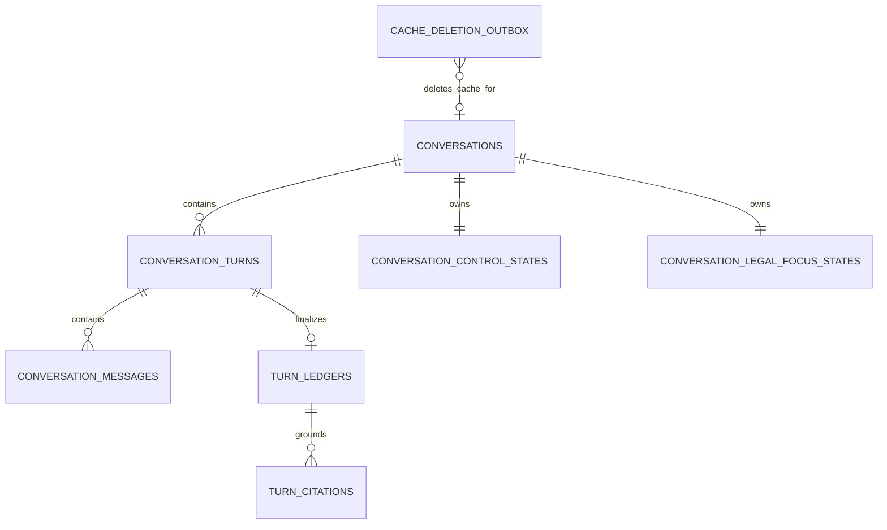

# Database Schema MVP — Hybrid Grounded Structured Memory

> **Loại tài liệu**: Database schema design
> **Trạng thái**: PROPOSED — chưa phải migration hoặc implementation plan
> **Phụ thuộc**: `context_memory_hybrid_architecture_plan.md`
> **Storage**: PostgreSQL là source of truth; Redis chỉ là cache

## 1. Mục tiêu và trade-off

Thiết kế dùng đúng **8 bảng PostgreSQL**. State nhỏ và chỉ truy cập theo
conversation được giữ trong JSONB để giảm table, join và migration.

Application validator chịu trách nhiệm cho invariant bên trong JSONB. PostgreSQL
vẫn bảo đảm ownership, cascade delete, idempotency, turn fencing, hai CAS version,
atomic transcript/ledger/citation và durable cache-deletion retry.

## 2. Danh sách đúng 8 bảng

| # | Table | Trách nhiệm |
|---:|---|---|
| 1 | `conversations` | Conversation lifecycle và ownership |
| 2 | `conversation_turns` | Idempotency, processing lifecycle, lease/recovery |
| 3 | `conversation_messages` | Full transcript |
| 4 | `conversation_control_states` | Pending clarification và `control_version` |
| 5 | `conversation_legal_focus_states` | Scope/focus/semantic anchors và `legal_focus_version` |
| 6 | `turn_ledgers` | Immutable interpretation, grounding và CAS audit |
| 7 | `turn_citations` | Used citation provenance và evidence fingerprint |
| 8 | `cache_deletion_outbox` | Retry xóa Redis sau hard-delete |

Redis keys không được tính là database table.

## 3. Storage relationship



Outbox không có FK tới conversation vì conversation row đã bị hard-delete trong
cùng transaction tạo event.

## 4. Quy ước chung

- UUID do backend tạo; không suy ordering từ UUID.
- Version/counter dùng `BIGINT`, bắt đầu từ `0`, không âm.
- Timestamp dùng `TIMESTAMPTZ` theo UTC.
- Enum dùng `TEXT + CHECK` ở MVP.
- Identity, lifecycle status và CAS version phải là column, không nằm trong JSONB.
- Mỗi JSONB có `schema_version`, strict schema và size/item limit.
- Legal interval dùng semantics `[effective_from, effective_to)`.
- Không có PostgreSQL FK sang Neo4j; canonical IDs do Linker validate.
- Conversation child dùng `ON DELETE CASCADE`.
- Không tạo transcript/answer full-text index mặc định.

Các sample dùng chung một conversation, turn và citation, thể hiện một grounded
turn đã resolve clarification bằng dependent CAS.

## 5. Table 1 — `conversations`

Lưu metadata, ownership, archive state và turn number kế tiếp. Đây là nguồn duy
nhất để kiểm tra conversation tồn tại và thuộc principal nào.

| Column | Type | Null | Contract |
|---|---|---:|---|
| `id` | UUID | no | Primary key |
| `owner_kind` | TEXT | no | `USER` hoặc `ANONYMOUS` |
| `owner_principal_id` | TEXT | no | Authenticated/signed subject ID |
| `title` | TEXT | yes | UI only, không dùng làm context |
| `status` | TEXT | no | `ACTIVE` hoặc `ARCHIVED` |
| `next_turn_no` | BIGINT | no | Cấp trong Begin-turn transaction |
| `created_at` | TIMESTAMPTZ | no | Creation time |
| `updated_at` | TIMESTAMPTZ | no | Last activity/sidebar ordering |
| `archived_at` | TIMESTAMPTZ | yes | Chỉ có khi archived |

Constraints/index: `next_turn_no >= 1`; archived yêu cầu `archived_at`; index
`(owner_principal_id, status, updated_at DESC)`; delete là hard-delete.

### Sample

```json
{
  "id": "11111111-1111-4111-8111-111111111111",
  "owner_kind": "ANONYMOUS", "owner_principal_id": "anon:browser_f4a2",
  "title": "Quyền thành lập công ty cổ phần", "status": "ACTIVE",
  "next_turn_no": 5, "archived_at": null,
  "created_at": "2026-08-02T09:00:00Z", "updated_at": "2026-08-02T09:08:05Z"
}
```

## 6. Table 2 — `conversation_turns`

Quản lý một request từ RECEIVED đến terminal state, chống duplicate retry, cấp
worker lease/fencing và cho phép recovery sau crash.

| Column | Type | Null | Contract |
|---|---|---:|---|
| `id` | UUID | no | Primary key |
| `conversation_id` | UUID | no | FK conversations |
| `request_id` | UUID | no | Global idempotency key |
| `turn_no` | BIGINT | no | Stable transcript ordering |
| `state` | TEXT | no | Turn lifecycle state |
| `lifecycle_version` | BIGINT | no | Claim/renew/finalize CAS |
| `lease_token` | UUID | yes | Current worker fencing token |
| `lease_owner` | TEXT | yes | Worker instance ID |
| `lease_expires_at` | TIMESTAMPTZ | yes | Recovery boundary |
| `attempt_count` | INTEGER | no | Số lần claim |
| `next_retry_at` | TIMESTAMPTZ | yes | Backoff boundary |
| `error_code` | TEXT | yes | Typed safe error |
| `error_detail` | JSONB | yes | Bounded, sanitized metadata |
| `created_at` | TIMESTAMPTZ | no | RECEIVED time |
| `started_at` | TIMESTAMPTZ | yes | Latest claim time |
| `completed_at` | TIMESTAMPTZ | yes | Finalize commit time |
| `updated_at` | TIMESTAMPTZ | no | Last lifecycle mutation |

States: `RECEIVED`, `PROCESSING`, `COMPLETED`, `FAILED_RETRYABLE`,
`FAILED_TERMINAL`. Unique `request_id`, `(conversation_id, turn_no)` và
`(conversation_id, id)` để child tables dùng composite FK.
PROCESSING yêu cầu lease fields; COMPLETED yêu cầu completed time và clear lease.
Partial indexes hỗ trợ expired PROCESSING và retryable scheduling.

### Sample

```json
{
  "id": "22222222-2222-4222-8222-222222222222",
  "conversation_id": "11111111-1111-4111-8111-111111111111",
  "request_id": "33333333-3333-4333-8333-333333333333", "turn_no": 4,
  "state": "COMPLETED", "lifecycle_version": 4, "attempt_count": 1,
  "lease_token": null, "lease_owner": null, "lease_expires_at": null,
  "next_retry_at": null, "error_code": null, "error_detail": null,
  "created_at": "2026-08-02T09:08:00Z", "started_at": "2026-08-02T09:08:00Z",
  "completed_at": "2026-08-02T09:08:05Z", "updated_at": "2026-08-02T09:08:05Z"
}
```

## 7. Table 3 — `conversation_messages`

Lưu full transcript cho UI/history. Message text không phải legal evidence,
canonical identity hoặc hard retrieval filter.

| Column | Type | Null | Contract |
|---|---|---:|---|
| `id` | UUID | no | Primary key |
| `conversation_id` | UUID | no | FK conversations |
| `turn_id` | UUID | no | Composite FK cùng conversation |
| `message_index` | SMALLINT | no | `0` user, `1` assistant |
| `role` | TEXT | no | `USER` hoặc `ASSISTANT` |
| `message_kind` | TEXT | no | Input/direct/legal/clarification/cannot-answer/error/meta |
| `content` | TEXT | no | Nội dung hiển thị |
| `created_at` | TIMESTAMPTZ | no | Persist time |

Unique `(turn_id, message_index)`/`(turn_id, role)`; CHECK role-index; index
`(conversation_id, turn_id, message_index)`. User insert ở Begin, assistant ở Finalize.

### Sample

```json
[
  {
    "id": "44444444-4444-4444-8444-444444444444",
    "conversation_id": "11111111-1111-4111-8111-111111111111",
    "turn_id": "22222222-2222-4222-8222-222222222222",
    "message_index": 0, "role": "USER", "message_kind": "USER_INPUT",
    "content": "Ý tôi là khoản 2 Điều 17.", "created_at": "2026-08-02T09:08:00Z"
  },
  {
    "id": "55555555-5555-4555-8555-555555555555",
    "conversation_id": "11111111-1111-4111-8111-111111111111",
    "turn_id": "22222222-2222-4222-8222-222222222222",
    "message_index": 1, "role": "ASSISTANT", "message_kind": "LEGAL_ANSWER",
    "content": "Khoản 2 Điều 17 quy định các chủ thể không có quyền thành lập và quản lý doanh nghiệp...",
    "created_at": "2026-08-02T09:08:05Z"
  }
]
```

## 8. Table 4 — `conversation_control_states`

Giữ pending clarification và candidate set trong một JSONB vì chúng luôn được
đọc/replace cùng nhau theo conversation.

| Column | Type | Null | Contract |
|---|---|---:|---|
| `conversation_id` | UUID | no | PK và FK conversations |
| `version` | BIGINT | no | `control_version` CAS |
| `pending_clarification` | JSONB | yes | Null hoặc strict pending object |
| `last_updated_turn_id` | UUID | yes | Composite FK cùng conversation |
| `updated_at` | TIMESTAMPTZ | no | Last control commit |

`version >= 0`; JSON null hoặc đúng schema; candidate ordering ổn định; canonical
IDs do Linker validate. Control commit chỉ replace cả object hoặc clear thành null.
Không tạo GIN index ở MVP.

### Sample current row

```json
{
  "conversation_id": "11111111-1111-4111-8111-111111111111", "version": 2,
  "pending_clarification": null,
  "last_updated_turn_id": "22222222-2222-4222-8222-222222222222",
  "updated_at": "2026-08-02T09:08:05Z"
}
```

### Sample pending JSONB trước khi resolve

```json
{
  "schema_version": 1,
  "clarification_id": "88888888-8888-4888-8888-888888888888",
  "source_turn_id": "99999999-9999-4999-8999-999999999999",
  "reason_code": "MULTIPLE_STRUCTURAL_REFERENTS", "ambiguous_text": "khoản 2",
  "set_at_user_turn": 3, "expires_after_user_turn": 4,
  "candidates": [{
    "candidate_no": 1, "node_type": "Clause",
    "canonical_id": "ldn_2020_art17_cl2", "document_id": "ldn_2020",
    "display_label": "Khoản 2 Điều 17 Luật Doanh nghiệp 2020"
  }]
}
```

## 9. Table 5 — `conversation_legal_focus_states`

Giữ legal memory trong một CAS row nhưng tách `scope_anchor`, `focus_anchors` và
`semantic_anchors` thành ba JSONB columns độc lập.

| Column | Type | Null | Contract |
|---|---|---:|---|
| `conversation_id` | UUID | no | PK và FK conversations |
| `version` | BIGINT | no | `legal_focus_version` CAS |
| `grounded_turn_count` | BIGINT | no | Semantic TTL clock |
| `last_grounded_turn_id` | UUID | yes | Composite FK sang ledger cùng conversation |
| `scope_anchor` | JSONB | no | Strict ScopeAnchor object |
| `focus_anchors` | JSONB | no | Strict FocusAnchor collection |
| `semantic_anchors` | JSONB | no | Strict semantic collection |
| `last_updated_at` | TIMESTAMPTZ | no | LegalFocusCommit time |

Application validates: primary thuộc scope; mọi focus có Document ancestor trong
scope; exact ID dedupe; new/refresh anchor có current used citation; retained
MERGE không refresh TTL/provenance; removed scope document loại focus bên dưới.
Table chỉ được replace từ GroundedAnswerResult hợp lệ; không có GIN index ở MVP.

### Sample

```json
{
  "conversation_id": "11111111-1111-4111-8111-111111111111",
  "version": 5, "grounded_turn_count": 4,
  "last_grounded_turn_id": "22222222-2222-4222-8222-222222222222",
  "scope_anchor": {
    "schema_version": 1, "scope_kind": "SINGLE",
    "primary_document_id": "ldn_2020",
    "documents": [{
      "document_id": "ldn_2020", "set_at_grounded_turn": 4,
      "ttl_grounded_turns": 5,
      "source_turn_id": "22222222-2222-4222-8222-222222222222",
      "citation_ids": ["66666666-6666-4666-8666-666666666666"]
    }]
  },
  "focus_anchors": {"schema_version": 1, "items": [{
    "node_type": "Clause", "node_id": "ldn_2020_art17_cl2",
    "document_id": "ldn_2020",
    "ancestor_path": ["ldn_2020", "ldn_2020_art17", "ldn_2020_art17_cl2"],
    "set_at_grounded_turn": 4, "ttl_grounded_turns": 3,
    "source_turn_id": "22222222-2222-4222-8222-222222222222",
    "citation_ids": ["66666666-6666-4666-8666-666666666666"]
  }]},
  "semantic_anchors": {"schema_version": 1, "items": [{
    "anchor_type": "LEGAL_SUBJECT", "canonical_id": "nguoi_quan_ly_doanh_nghiep",
    "set_at_grounded_turn": 4, "ttl_grounded_turns": 5,
    "source_turn_id": "22222222-2222-4222-8222-222222222222",
    "citation_ids": ["66666666-6666-4666-8666-666666666666"]
  }]},
  "last_updated_at": "2026-08-02T09:08:05Z"
}
```

## 10. Table 6 — `turn_ledgers`

Lưu immutable audit của interpretation, retrieval, grounding và hai CAS. Ledger
không thay transcript và không được dùng như legal evidence.

| Column | Type | Null | Contract |
|---|---|---:|---|
| `turn_id` | UUID | no | PK và FK conversation_turns |
| `conversation_id` | UUID | no | Composite ownership integrity |
| `turn_kind` | TEXT | no | Direct/clarification/output-meta/legal |
| `standalone_query` | TEXT | yes | Required cho legal query |
| `interpretation` | JSONB | no | Resolved references/classifier metadata |
| `retrieval_metadata` | JSONB | yes | Intent, temporal, filters, strategy |
| `answer_outcome` | TEXT | no | `SUPPORTED`, `CANNOT_ANSWER`, `ERROR` |
| `reason_code` | TEXT | yes | Stable outcome reason |
| `contracts` | JSONB | no | Retrieval/projection/answer/grounding versions |
| `grounding_result` | JSONB | yes | Claims, fingerprint, scope/focus operations |
| `commit_result` | JSONB | no | Dependency mode và CAS statuses/versions |
| `reasoning_paths` | JSONB | no | Chỉ grounded used paths |
| `created_at` | TIMESTAMPTZ | no | Finalize time |

Một ledger/turn; unique `(conversation_id, turn_id)` cho citation composite FK;
immutable after insert. Finalize reject SUPPORTED thiếu grounding/citation row.
Index `(conversation_id, created_at DESC)`; không GIN ở MVP.

### Sample

```json
{
  "turn_id": "22222222-2222-4222-8222-222222222222",
  "conversation_id": "11111111-1111-4111-8111-111111111111",
  "turn_kind": "LEGAL_QUERY",
  "standalone_query": "Khoản 2 Điều 17 Luật Doanh nghiệp 2020 quy định những chủ thể nào không có quyền thành lập và quản lý doanh nghiệp?",
  "interpretation": {
    "schema_version": 1,
    "resolved_clarification_id": "88888888-8888-4888-8888-888888888888",
    "resolved_references": ["ldn_2020_art17_cl2"]
  },
  "retrieval_metadata": {
    "schema_version": 1, "intent": "factual", "query_date": null,
    "filters_applied": {"document_ids": ["ldn_2020"]}, "strategy": "hybrid"
  },
  "answer_outcome": "SUPPORTED", "reason_code": null,
  "contracts": {
    "retrieval": "retrieval-runtime-v2", "projection": "answer-context-v2",
    "answer": "answer-generation-v1", "grounding": "grounded-answer-v1"
  },
  "grounding_result": {
    "schema_version": 1,
    "result_fingerprint": "bbbbbbbbbbbbbbbbbbbbbbbbbbbbbbbbbbbbbbbbbbbbbbbbbbbbbbbbbbbbbbbb",
    "scope_operation": "REPLACE", "focus_operation": "REPLACE",
    "retained_scope_document_ids": [], "retained_focus_anchor_ids": [],
    "claim_citations": [{"claim_id": "claim_1", "unit_ids": ["ldn_2020_art17_cl2"]}]
  },
  "commit_result": {
    "schema_version": 1, "dependency_mode": "ALL_OR_NOTHING",
    "control": {"status": "COMMITTED", "expected_version": 1, "committed_version": 2},
    "legal_focus": {"status": "COMMITTED", "expected_version": 4, "committed_version": 5}
  },
  "reasoning_paths": {"schema_version": 1, "items": []},
  "created_at": "2026-08-02T09:08:05Z"
}
```

## 11. Table 7 — `turn_citations`

Lưu citation answer thực sự dùng. Retrieved-but-unused evidence không được ghi.
Đây là provenance cho anchors và stale-evidence checking.

| Column | Type | Null | Contract |
|---|---|---:|---|
| `id` | UUID | no | Primary key |
| `conversation_id` | UUID | no | Cross-conversation integrity |
| `turn_id` | UUID | no | FK turn ledger |
| `citation_no` | SMALLINT | no | Answer ordering |
| `unit_id` | TEXT | no | Canonical citable unit |
| `unit_type` | TEXT | no | Article/Clause/Point |
| `document_id` | TEXT | no | Canonical Document root |
| `ancestor_path` | JSONB | no | Canonical hierarchy snapshot |
| `citation_label` | TEXT | no | Display label at answer time |
| `content_fingerprint` | TEXT | no | Stale-evidence hash |
| `fingerprint_version` | TEXT | no | Hash contract version |
| `effective_from` | DATE | yes | Temporal snapshot |
| `effective_to` | DATE | yes | Exclusive interval end |
| `legal_status` | TEXT | yes | Legal status snapshot |
| `deep_link` | TEXT | no | Presentation only, excluded from hash |

Unique `(turn_id, citation_no)`/`(turn_id, unit_id)`; path bắt đầu bằng document
và kết thúc bằng unit; fingerprint gồm content/hierarchy/temporal/status, không
gồm rank/deep link. Index `(unit_id, fingerprint_version)`.

### Sample

```json
{
  "id": "66666666-6666-4666-8666-666666666666",
  "conversation_id": "11111111-1111-4111-8111-111111111111",
  "turn_id": "22222222-2222-4222-8222-222222222222", "citation_no": 1,
  "unit_id": "ldn_2020_art17_cl2", "unit_type": "Clause",
  "document_id": "ldn_2020",
  "ancestor_path": ["ldn_2020", "ldn_2020_art17", "ldn_2020_art17_cl2"],
  "citation_label": "Khoản 2 Điều 17 Luật Doanh nghiệp 2020",
  "content_fingerprint": "aaaaaaaaaaaaaaaaaaaaaaaaaaaaaaaaaaaaaaaaaaaaaaaaaaaaaaaaaaaaaaaa",
  "fingerprint_version": "legal-evidence-sha256-v1",
  "effective_from": "2021-01-01", "effective_to": null, "legal_status": "ACTIVE",
  "deep_link": "/explorer?document=ldn_2020&article=ldn_2020_art17&clause=ldn_2020_art17_cl2"
}
```

## 12. Table 8 — `cache_deletion_outbox`

Bảo đảm Redis content được xóa dù Redis lỗi khi PostgreSQL hard-delete. Table chỉ
chứa operational metadata, không chứa owner, transcript hoặc answer.

| Column | Type | Null | Contract |
|---|---|---:|---|
| `event_id` | UUID | no | Primary key |
| `conversation_id` | UUID | no | Deleted cache identity; không FK |
| `status` | TEXT | no | `PENDING`, `PROCESSING`, `PROCESSED`, `FAILED_RETRYABLE` |
| `attempt_count` | INTEGER | no | Delivery attempts |
| `next_attempt_at` | TIMESTAMPTZ | yes | Retry backoff |
| `last_error_code` | TEXT | yes | Safe operational reason |
| `created_at` | TIMESTAMPTZ | no | Event creation time |
| `processed_at` | TIMESTAMPTZ | yes | Redis deletion acknowledgement |

`attempt_count >= 0`; PROCESSED yêu cầu processed time; partial index
`created_at WHERE processed_at IS NULL`; acknowledged rows được purge sớm.

### Sample

Conversation ID bên dưới thuộc conversation khác đã bị xóa.

```json
{
  "event_id": "77777777-7777-4777-8777-777777777777",
  "conversation_id": "aaaaaaaa-aaaa-4aaa-8aaa-aaaaaaaaaaaa",
  "status": "PENDING", "attempt_count": 0,
  "next_attempt_at": "2026-08-02T09:10:00Z", "last_error_code": null,
  "created_at": "2026-08-02T09:10:00Z", "processed_at": null
}
```

## 13. Hai CAS và transaction boundary

`control_version` và `legal_focus_version` độc lập. Với `INDEPENDENT`, một CAS
stale không rollback namespace còn lại; ledger ghi status/version riêng.

Turn consume pending clarification dùng `ALL_OR_NOTHING`: lock control rồi legal
row, kiểm tra cả hai expected versions trước mutation. Nếu một stale, cả hai state
giữ nguyên; actual conflict nhận `STALE_VERSION`, commit kia nhận
`DEPENDENCY_ABORTED`. Transcript, ledger và COMPLETED turn vẫn commit atomically.

JSONB state được validate thành typed immutable object trước transaction.
Repository chỉ replace whole validated value, không tự merge hoặc suy semantics.

## 14. Turn lifecycle và crash recovery

1. Create conversation insert conversation + hai state rows version `0`.
2. Begin cấp turn number, insert user message và RECEIVED turn.
3. Claim CAS sang PROCESSING, tạo lease token, tăng attempt count.
4. Worker renew lease; mất lease thì không được Finalize.
5. Retrieval/generation chạy ngoài database transaction.
6. Finalize insert assistant, ledger, citations, state commits và COMPLETED.
7. Retry COMPLETED trả persisted response, không gọi provider lại.
8. Expired PROCESSING/FAILED_RETRYABLE được claim bằng token/version mới.

Database effects exactly-once theo request/turn ID. Provider có thể at-least-once
nếu crash trước Finalize. Validated answer phải Finalize trước SSE token đầu tiên.

## 15. Redis cache

| Key | Payload | TTL |
|---|---|---|
| `ctx:{conversation_id}:control` | control version + snapshot | 24h inactivity |
| `ctx:{conversation_id}:legal` | legal version + snapshot | 24h inactivity |
| `ctx:{conversation_id}:deleted` | tombstone, không có content | Lớn hơn max recovery window |

- read sau PostgreSQL existence/ownership/current-version check;
- cache write dùng compare-version atomic;
- Redis không giữ transcript, ledger, ownership hoặc turn lease;
- delete transaction insert outbox event rồi hard-delete conversation;
- worker đặt tombstone, xóa content keys và mark event processed;
- cache miss/error đọc PostgreSQL, không đổi behavior.

## 16. Validation boundary

| Invariant | Owner |
|---|---|
| PK, FK, uniqueness, lifecycle scalar checks | PostgreSQL |
| JSONB shape, size, ordering | Pydantic/application schema |
| Focus/primary thuộc scope | Legal-focus validator |
| Replace/merge và retained TTL | GroundedAnswerResult validator |
| Canonical IDs và hierarchy | Neo4j Reference Linker |
| Used citations và fingerprint | Grounding validator |
| CAS dependency | Finalize transaction |
| Cache version/tombstone | Redis atomic operation |

## 17. Delete, privacy và current gap

- Hard-delete conversation cascade sáu child tables; outbox sống đến Redis ack.
- Archive chỉ đổi status, không xóa transcript hoặc memory.
- Logs không chứa message, answer, evidence, JSONB state hoặc lease token.
- Backup retention cần policy riêng; xóa primary DB không tự xóa backup.
- Application query luôn kèm owner predicate; Redis không thay ownership check.

Backend hiện chưa có PostgreSQL, Redis, migration layer, persistent conversation
API hoặc GroundedAnswerResult DTO. Đây là target schema, chưa phải implemented DB.

Không thuộc tài liệu: DDL/migration code, ORM, endpoint DTO, deployment sizing,
backup schedule và execution task breakdown.
